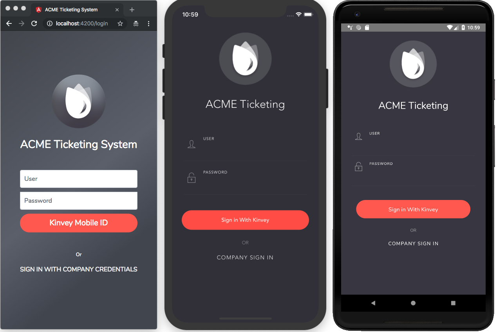

# One project. One language. Three apps.

It’s 2018 and we’ve achieved the dream: [robots that make phone calls for us](https://www.theverge.com/2018/5/8/17332070/google-assistant-makes-phone-call-demo-duplex-io-2018). Oh, and we can also use JavaScript to build apps for basically any platform. That’s probably the more relevant dream.

And because JavaScript can be used to create apps on virtually any platform, developers have created a variety of projects that let you build for the web, for iOS, and for Android—AT THE SAME TIME 😮

Want to learn more? [**Join us on Thursday, December 6th at 11:00 AM EST**](https://attendee.gotowebinar.com/register/1129877235012219907) as we look at how to build for multiple platforms in detail.

In this free online webinar you’ll learn about:

* **NativeScript and React Native**, both of which have the ability to build web apps, native iOS apps, and native Android apps, simultaneously.
* **Best practices**, especially when deciding when to build for multiple platforms.
* **How to get started**, and specifically how to get started using NativeScript Schematics and React Native Web. You’ll watch the same app built twice so you can compare and contrast the two approaches.

<a class="Btn" href="https://attendee.gotowebinar.com/register/1129877235012219907">Register for the Webinar</a>
