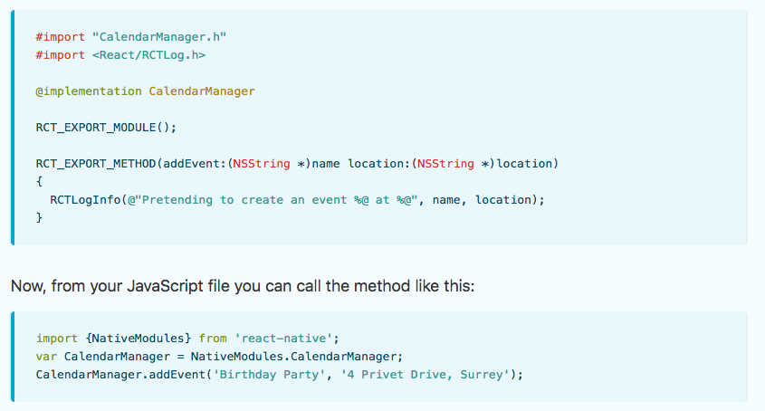
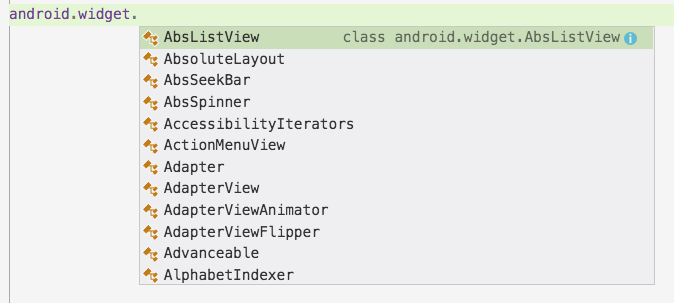

# Would Airbnb Have Fared Better With NativeScript Instead of React Native?

> **BACKGROUND**: Last week, Airbnb’s engineering team published a [5-part series on why they’re moving away from React Native](https://medium.com/airbnb-engineering/react-native-at-airbnb-f95aa460be1c). It’s well written, and worth reading through if you’re looking for some context for this article’s discussion. All quotes you see in this article are from the Airbnb writeup.

As you might imagine Airbnb’s announcement piqued our interest on the NativeScript team. This is mostly because a lot of Airbnb’s feedback was very technical, and delved into areas where React Native and NativeScript are quite different. Therefore as we read through the series we couldn’t help but wonder—would Airbnb have fared better with NativeScript?


Now, this is the NativeScript blog, so of course I’d love to tell you that NativeScript would have _totally_ worked way better. That NativeScript would’ve helped Airbnb built 300% faster apps that helped them acquire 500% more users.

But, the truth is... NativeScript would almost certainly have suffered the same fate as React Native at Airbnb. Per their own words, Airbnb is trying to build “world-class apps” with a team of “more than 100 mobile engineers”. And, honestly, building the _absolute best_ applications with any cross-platform tool is not easy. That rule applies with NativeScript; it applies with React Native; and it even applies with tools like Electron.

So we don’t necessarily think Airbnb would’ve succeeded with NativeScript, but we do think the topic of NativeScript at Airbnb is an interesting way to compare the architectures of React Native and NativeScript—something we get a lot of requests to do. Therefore, in this article we’ll walk through Airbnb’s complaints in detail, and talk about how some of those same problems could’ve been handled in NativeScript.

We’ll start with the things NativeScript does well (this is the NativeScript blog after all), and move on to some of the things NativeScript does, well, less well 🙂

## The bridge

>  “React Native has a bridge API to communicate between native and React Native. While it works as expected, it is extremely cumbersome to write.”

The way that React Native and NativeScript allow developers to access native APIs is the perhaps the single biggest architectureal difference between the two frameworks.

Both React Native and NativeScript provide a series of cross-platform APIs for common mobile tasks. For example in [React Native you use an API named `Animated`](https://facebook.github.io/react-native/docs/network.html) for animations, and in [NativeScript you use an API named `Animation`](https://docs.nativescript.org/angular/ui/animation-code). But despite slightly different names the APIs provide very similar functionality (animating user interface components). In most cases these cross-platform APIs are similar, and in some cases they’re even identical—for example, both frameworks provide support for the web’s `fetch()` and `XMLHttpRequest` APIs.

The architectural differences between the frameworks come when you need to do something that _isn’t_ a common mobile task—aka, when you need to perform some native action not provided by the frameworks’ cross-platform APIs. In React Native to access native iOS and Android APIs you need to use a series of APIs commonly referred to as the bridge APIs (here are the [docs for iOS](https://facebook.github.io/react-native/docs/native-modules-ios.html); here are the [docs for Android](https://facebook.github.io/react-native/docs/native-modules-android.html)).

A full breakdown of the bridging APIs is out of the scope of this article, but the key thing to know is that these APIs require you to write both native and JavaScript code. As a concrete example of that, the image below shows the first example from React Native’s iOS bridging documentation—notice the iOS code on top, and the TypeScript code underneath.



React Native does this because React itself is running in a JavaScript Virtual Machine, and therefore cannot access native APIs directly. Hooks like React Native’s `RCT_EXPORT_METHOD` give native code the ability to tie into the app’s JavaScript context, allowing both to coexist. As Airbnb notes, these APIs do work as expected, and they successfully drive a lot of apps in both the App Store and Google Play. However, this architecture is not without its problems.

> “These bridges were some of the more complex pieces because we wanted to wrap the existing Android and iOS APIs into something that was consistent and canonical for React. While keeping these bridges up to date with the rapid iteration and development of new infrastructure was a constant game of catch up, the investment by the infrastructure team made product work much easier.”

To leverage the bridge in a real-world app you have to write code in three places—once for iOS, once for Android, and once for the web—which creates a lot of moving pieces to keep in sync, especially as iOS, Android, React, and React Native all continue to release new versions.

Next, you need to consider that not only is your code in three different places, but that code might be written by three different teams that specialize in each platform.

> “In React Native, we started with a blank slate and had to write or create bridges of all existing infrastructure. This meant that there were times in which a product engineer needed some functionality that didn’t yet exist. At that point, they either had to work in a platform they were unfamiliar with and outside the scope of their project to build it or be blocked until it could be created.”

> “In addition, large amounts of bridging infrastructure were required to enable product engineers to work effectively.”

In NativeScript we took a completely different approach to accessing native APIs. Instead of a bridge, NativeScript injects all iOS and Android APIs into the JavaScript Virtual Machine directly. (The full technical details of how this works is out of the scope of this article, but it’s [worth a read](https://developer.telerik.com/featured/nativescript-works/) if you find the architectures of these frameworks at all interesting.)

This means that if you want need to access a native API in NativeScript... you just do it. For example, the following code is valid NativeScript code that returns a JavaScript integer of `3` on Android.

```
java.lang.Math.min(3, 4)
```

If you’ve developed iOS or Android app using any cross-platform framework, you know just how often you need to access native APIs to tweak the behavior of your app. You probably don’t need `java.lang.Math.min`, but you might want to tweak your app’s status bar, tweak how your app interacts with the keyboard, or build [an entire plugin](https://market.nativescript.org/) for your app that abstracts these APIs for others.

Writing your code in one language means has some auxillary benefits as well, such as less context shifting, better tool reuse (prettier, linting, etc), and that you get to stay in one IDE. The advantages are appealing enough that Airbnb was trying to recreate a NativeScript-like approach in late 2017.

> “We began to investigate automatically generating bridge code from TypeScript definitions towards the end of 2017 but it was too little too late.”

All that said, it’s not like NativeScript’s bridging approach is perfect. Although you can write native code in JavaScript using NativeScript, there’s a definite learning curve to figure out [NativeScript’s bridging conventions](https://docs.nativescript.org/angular/core-concepts/accessing-native-apis-with-javascript) once you move beyond simple one-line examples. (Look through the [source code of the NativeScript core modules](https://github.com/NativeScript/NativeScript/tree/master/tns-core-modules) if you want to see what that looks like at scale.)

Furthermore, even though NativeScript allows you to write your code in one language, you’ll still need iOS and Android development expertise if you want to write non-trivial native code for your applications. And React Native is better tailored to apps that need a large amount of native code, as native developers prefer to write in native languages rather than JavaScript or TypeScript.

We feel that NativeScript’s sweet spot is in apps that need the ability to easily leverage native code in their apps, but still want the majority of their apps driven by cross-platform friendly JavaScript or TypeScript code. But there’s more than just the ability to access native APIs that’s relevant to this discussion, let’s move on to discuss another common pain point when working with these frameworks—type safety.

## Type safety

> “We also experienced many issues in which the types coming from JavaScript were unexpected. For example, integers were often wrapped by strings, an issue that isn’t realized until it is passed over a bridge. To make matters worse, sometimes iOS will fail silently while Android will crash. 

Some of the more, um, _interesting_ code in NativeScript is the code that converts values from Java <--> JavaScript and Objective-C <--> JavaScript. I’m not familiar enough with the inner details of React Native to comment on their exact approach here, but I’m sure they have some fun stories to tell.

Type conversion between multiple platforms is not fun regardless of what platform you use, but we think we have a bit of an advantage in how we handle things in NativeScript—and that advantage is [TypeScript](https://www.typescriptlang.org/).


I have mixed feelings about using TypeScript in web apps, and I’ve even given [a talk on the subject](https://www.youtube.com/watch?v=w6rdLx2LYz8), but for mobile apps I now consider TypeScript an absolute necessity because of how well the language helps you work with APIs you aren’t very familiar with (which is common in mobile apps).

In NativeScript we built our [cross-platform modules](https://github.com/nativescript/nativescript) with TypeScript since day one, meaning, you can easily explore the APIs we offer right in your editor.


More importantly, we also provide TypeScript type definitions for the native iOS and Android APIs we inject into the JavaScript Virtual Machine. Meaning, you can write native code—in TypeScript—getting many of the same benefits you would get from writing your code in Xcode or Android Studio.




This benefit helps JavaScript developers write native code without errors, and it helps native developers feel more at home in a JavaScript codebase—something that Airbnb struggled with.

> “JavaScript is an untyped language. The lack of type safety was both difficult to scale and became a point of contention for mobile engineers used to typed languages who may have otherwise been interested in learning React Native.”

> “A side-effect of JavaScript being untyped is that refactoring was extremely difficult and error-prone. Renaming props, especially props with a common name like onClick or props that are passed through multiple components were a nightmare to refactor accurately. To make matters worse, the refactors broke in production instead of at compile time and were hard to add proper static analysis for.”

If there’s any downside to TypeScript it’s that it’s yet another tool for you to maintain, update, and integrate. I personally haven’t run into these issues in my own NativeScript apps, but Airbnb mentioned problems when they attempted to evaluate TypeScript.

> “We also explored TypeScript but integrating it into our existing infrastructure such as babel and metro bundler proved to be problematic. However, we are continuing to actively investigate TypeScript on web.”

Let’s shift our discussion from working with native APIs over to a user interface component that’s extremely common in mobile apps—the list.

## Lists

A whole lot of mobile apps are nothing more than glorified lists—Facebook, Twitter, etc. The list is a cornerstone of a mobile app development environment, and it’s something that has caused problems for React Native from the beginning.

> “[Long Lists] React Native has made some progress in this area with libraries like FlatList. However, they are nowhere near the maturity and flexibility of RecyclerView on Android or UICollectionView on iOS. Many of the limitations are difficult to overcome because of the threading. Adapter data can’t be accessed synchronously so it is possible to see views flash in as they get asynchronously rendered while scrolling quickly. Text also can’t be measured synchronously so iOS can’t make certain optimizations with pre-computed cell heights.”

The key thing Airbnb mentions here is “threading”. React Native famously uses a [multi-threaded achitecture](https://www.facebook.com/notes/andy-street/react-native-scheduling/10153916310914590/) where JavaScript and the user interface run on separate threads. While this has some definite advantages, mostly that JavaScript processing does not interfere with UI rendering, there are some tradeoffs as well.

Take `RecyclerView` on Android or `UICollectionView` on iOS. These are extremely powerful built-in native APIs for building lists that asynchronously render rows as the user scrolls. However, React Native cannot use these APIs because the native component (`RecyclerView` or `UICollectionView`) cannot asynchronously access data stored in JavaScript; they’re on different threads. As Airbnb noted, React Native has thrown a lot of engineering muscle into solving this problem, and their [newer APIs like `FlatList`](https://facebook.github.io/react-native/docs/flatlist.html) are quite good, but it’s really hard to build a custom solution that can compare with what’s built into iOS and Android.

In NativeScript we use a [single threaded model](https://developer.telerik.com/featured/benefits-single-threading-model-nativescript/), as it’s what allows us to provide fast access to the native APIs that we discussed earlier. This means that we’re not subject to the same restrictions as React Native, and we absolutely  leverage native APIs like `RecyclerView` and `UICollectionView`, and we don’t have to mess with building list solutions from the ground up. To give you a sense of what that looks like, here’s what a sample NativeScript app looks like if I just casually toss 50,000 items into a list.


_Check out this app’s source and run it for yourself in [NativeScript Playground](https://play.nativescript.org/?template=play-js&id=ieaS3B)._

Now there are downsides of using a single-threaded architecture like NativeScript does. If you try to do too much in JavaScript in your NativeScript app you could cause jank in your UI. But NativeScript does offer [APIs for offloading this processing](https://docs.nativescript.org/core-concepts/multithreading-model) when you do hit them. 

It’s worth mentioning that this is the exact same problem you’d encounter creating “raw” native apps for iOS or Android using Obj-C, Swift or Java. By default, native code runs on the same thread as native UI, so CPU-intensive operations in native code can also degrade app performance and cause dropped frames.

And React Native must see some benefits in being able to make synchrounous calls from JavaScript to native, as they recently announced that they’re [redesigning React Native’s threading model](https://facebook.github.io/react-native/blog/2018/06/14/state-of-react-native-2018) to allow for this exact use case that NativeScript does by default. Once implemented, it’s possible that React Native should be able to close the gap when it comes to list performance.

While on the topic of performance, let’s move on to one thing that you might not realize has a huge impact on the performance of JavaScript-driven native apps—JavaScript virtual machines.

## JavaScript VMs

NativeScript and React Native use JavaScript virtual machines to drive your native apps. React Native use Apple’s JavaScriptCore on both iOS and Android, and NativeScript uses JavaScriptCore on iOS and Google’s V8 on Android.

And just a browser’s JavaScript engine can have a huge impact on its performance, the same is true of JavaScript-driven native apps as well.

> “Android doesn’t ship its own JavaScriptCore so React Native bundles its own. However, the one you get by default is ancient. As a result, we had to go out of our way to bundle a newer one.”

Updating a JavaScript VM in a framework like NativeScript and React Native can be very hard, as the VM code is intertwined in some of the gnarliest bits of these frameworks. We here at NativeScript have been guilty of letting our VM version languish as well for this reason, BUT, we very recently updated to a modern version of V8 and got a _huge_ (~50%) boost in performance. For example, the image below shows the difference in startup time between a NativeScript app before (left) and after (right) the V8 update.


Updating a JavaScript VM also gives you the ability to leverage new JavaScript language features as well. For example at NativeScript, now that we have newer versions of both JavaScriptCore and V8 in place, we’re working on allowing our users to use all JavaScript ECMAScript 6 features without using a precompiler.

And with that, I’m now done going through the things I think Airbnb would’ve like about NativeScript, at least given the current state of both frameworks. To try to be at least somewhat fair though, I think it’s worth mentioning a few things that I think Airbnb would’ve not liked about NativeScript.

## No React support

> “Our website is built primarily with React.”

Airbnb talks extensively about how their use of React on the web contributed to them using them React for their native apps. They also talk about how, towards the end of their React Native usage, they started to investigate code sharing between the web and native apps.

> “Late in the React Native exploration, we began building for web, iOS, and Android at once. Given that web also uses Redux, we found large swaths of code that could be shared across web and native platforms with no alterations.”

Over at NativeScript we’ve seen how important consolidating on a framework for web and native apps can be for a company. The initial version of NativeScript offered no framework support, and although we certainly had usage, when we [unveiled integrated Angular support back in 2016](https://www.nativescript.org/blog/n-is-for-nativescript-at-ng-conf). We’ve seem the same jump in usage when the NativeScript community released [Vue.js support for NativeScript](https://nativescript-vue.org/).

That being said we do not offer any support for React, which companies like Airbnb would probably not be happy with. The thing is, supporting frameworks is a lot of work, especially when you think about the necessary template/documentation/maintenance workload, and we don’t think we can do React better than Facebook.

## Hot reload

One of the biggest benefits to using JavaScript instead of code is how much easier iterating on code changes can be. Because your source code is on JavaScript, you don’t have to compile your code after every chance, which can lead to some enormous productivity gains.

> “One thing that was immediately obvious when switching from React Native back to native was the iteration speed. Going from a world where you can reliably test your changes in a second or two to one where may have to wait up to 15 minutes was unacceptable.”

NativeScript and React Native are both able to take advantage of this setup. For example, I recently used the gif below to showcase how you can push out changes (in this case a randomly generated gradient background) to multiple devices simultaneously.


But React Native takes this a bit further with a feature they call [hot reloading](https://facebook.github.io/react-native/blog/2016/03/24/introducing-hot-reloading.html). Hot reloading allows NativeScript to reload an app after a change without losing the application’s state. You can read through the [React Native team’s writeup on the feature](https://facebook.github.io/react-native/blog/2016/03/24/introducing-hot-reloading.html), but as a developer this feature essentially means you’re able to test your JavaScript changes incredibly fast.

NativeScript does not offer hot reloading yet, but it’s something we’re actively working on. Stay tuned to the [NativeScript blog](https://www.nativescript.org/blog) for details on future plans and releases.

## Integrating into native apps

If you’re a company with large existing native iOS and Android apps, the idea of rewriting that entire app to a new technology stack is oftentimes a non-starter.

> “We integrated React Native into large existing apps that continued to move at a very fast pace.”

Although we at NativeScript do offer the ability to run within existing apps (here are [our iOS docs](https://docs.nativescript.org/angular/guides/integration-with-existing-ios-and-android-apps/extend-existing-ios-app); here are [our Android docs](https://docs.nativescript.org/angular/guides/integration-with-existing-ios-and-android-apps/extend-existing-android-app)), our support is currently experimental in nature, and not an officially supported usage scenario.

Meanwhile the React Native team has [heavily invested in this space](https://facebook.github.io/react-native/docs/integration-with-existing-apps.html) and has a lot of battle tested apps using this approach in production scenarios (including Airbnb). Furtermore, Facebook has [stated better integration with native apps will be a focus of their upcoming rearchitecture](https://facebook.github.io/react-native/blog/2018/06/14/state-of-react-native-2018), so theoretically the story will only get better for using React Native in native apps.

## Community

Finally, perhaps the point we hear the most when developers compare NativeScript to React Native is in community size. And to be fair, there’s a lot of truth to this—React Native has an objectively larger community than NativeScript, and it’s therefore easier to find help on common issues that you run into during development, which is definitely important.

But while this is true, that doesn’t mean we here at NativeScript are a small player. NativeScript [averages well over 100k downloads a month](https://npm-stat.com/charts.html?package=nativescript&from=2017-01-01&to=2018-06-24); we have a [very active community forum](https://discourse.nativescript.org/); we have [a community Slack channel with over 7k members](https://developer.telerik.com/wp-login.php?action=slack-invitation); and we have a [marketplace full of plugins](https://market.nativescript.org/) from a [over 300 plugin authors](https://market.nativescript.org/authors).

Plus, if you pair NativeScript with Angular or Vue.js, you also get to leverage those incredibly active communities to help you solve common framework problems as well.

## Closing thoughts

As I mentioned in the beginning of this article, despite the advantages NativeScript can offer a company like Airbnb, ultimately I don’t think Airbnb would’ve been any more successful because of the highly custom apps they’re building.

But most companies aren’t building world-class applications with 100s of mobile engineers. Most companies need a really good app; they need that app quickly; and they need to leverage web developers to get that app off the ground.

It’s situations like this where both React Native and NativeScript can both offer huge productivity gains to your average development shop. And although the two frameworks both are similar in their approach to app development at a high level, there are some non-trivial architectual differences that can really impact how successful your development processes will be. 

Like any big technology decision, it’s usually a good idea to build a small proof of concept with all of your options before embarking on a full-blown app development project. If you’d like to give NativeScript a shot, start with our [tutorials in NativeScript Playground](https://play.nativescript.org/?template=groceries-js&tutorial=groceries-js&autoStart=true), a browser-based experience that’ll help you get up and running quickly. And if you have any questions about NativeScript from this article, feel free to reach out in the comments.
