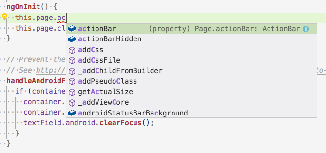
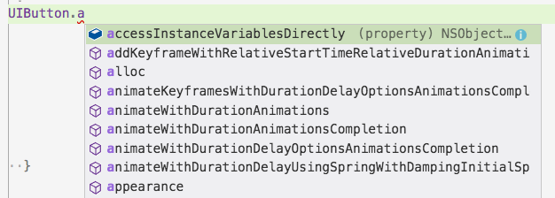

# Would Airbnb Have Fared Better With NativeScript?

> **BACKGROUND**: Last week, Airbnb’s engineering team published a [5-part series on why they’re moving away from React Native](https://medium.com/airbnb-engineering/react-native-at-airbnb-f95aa460be1c). It’s well written, and worth reading through if you’re looking for some context for this article’s discussion. All quotes you see in this article are from the Airbnb writeup.

Airbnb’s announcement piqued our interest on the NativeScript team. NativeScript and React Native share a similar architecture, so oftentimes feedback about React Native applies equally to NativeScript, especially when it’s how companies structure their team to handle both web and mobile development.

But in this case a lot of Airbnb’s feedback was very technical, and delved into areas where React Native and NativeScript are quite different. Therefore as we read through the series we couldn’t help but wonder—would Airbnb have fared better with NativeScript?


Now, this is the NativeScript blog, so of course I’d love to tell you that NativeScript would have _totally_ worked way better. That NativeScript would’ve helped Airbnb built 300% faster apps that helped them acquire 500% more users.

But, the truth is... NativeScript would almost certainly have suffered the same fate as React Native at Airbnb. Per their own words, Airbnb is trying to build “world-class apps” with a team of “more than 100 mobile engineers”. And, building the _absolute best_ applications is not easy with any cross-platform tool. That rule applies with NativeScript; it applies with React Native; and it even applies with tools like Electron.

Nevertheless, we think the topic of NativeScript at Airbnb is an interesting way to compare the architectures of React Native and NativeScript—something we get a lot of requests to do. Therefore, in this article we’ll walk through Airbnb’s complaints in detail, and talk about how some of those same problems could’ve been handled in NativeScript.

We’ll start with the things NativeScript does well (this is the NativeScript blog after all), and move on to some of the things NativeScript does, well, less well 🙂

## The bridge

>  “React Native has a bridge API to communicate between native and React Native. While it works as expected, it is extremely cumbersome to write.”

The way that React Native and NativeScript allow developers to access native APIs is the perhaps the single biggest architectureal difference between the two frameworks.

Both React Native and NativeScript provide a series of cross-platform APIs for common mobile tasks. For example in [React Native you use an API named `Animated`](https://facebook.github.io/react-native/docs/network.html) for animations, and in [NativeScript you use an API named `Animation`](https://docs.nativescript.org/angular/ui/animation-code), however they provide very similar functionality (animating user interface components). In some cases the NativeScript and React Native cross-platform APIs are identical, for example, both frameworks provide support for the web’s `fetch()` and `XMLHttpRequest` APIs.

The architectural differences come when you need to do something that isn’t a super common mobile task—aka, when you need to perform some native action not provided by the cross-platform APIs. In React Native to access native iOS and Android APIs you need to use a series of bridge APIs (here’s are [docs for iOS](https://facebook.github.io/react-native/docs/native-modules-ios.html); here are the [docs for Android](https://facebook.github.io/react-native/docs/native-modules-android.html)).

A full breakdown of the bridging APIs is out of the scope of this article, but the thing I want you to note is how these APIs require you to write both native and JavaScript code. As a concrete example of that the image below shows the first example from React Native’s iOS bridging documentation—notice the iOS code on top, and the TypeScript code underneath.


The reason React Native takes this approach is because React itself is running in a JavaScript Virtual Machine, and therefore cannot access native APIs directly. Hooks like React Native’s `RCT_EXPORT_METHOD` give native code the ability to tie into the app’s JavaScript context, allowing both to coexist. This works as expected, and drives a lot of apps in both the App Store and Google Play. However, this architecture is not without its problems.

> “These bridges were some of the more complex pieces because we wanted to wrap the existing Android and iOS APIs into something that was consistent and canonical for React. While keeping these bridges up to date with the rapid iteration and development of new infrastructure was a constant game of catch up, the investment by the infrastructure team made product work much easier.”

To create a bridge for a real-world app you essentially have to write code in three places—once for iOS, once for Android, and once for the web—which creates a lot of moving pieces to keep in sync as iOS, Android, React, and React Native all continue to evolve.

Then you have to consider that not only is your code in three different places, but that code might be written by three different teams that specialize in each platform.

> “In React Native, we started with a blank slate and had to write or create bridges of all existing infrastructure. This meant that there were times in which a product engineer needed some functionality that didn’t yet exist. At that point, they either had to work in a platform they were unfamiliar with and outside the scope of their project to build it or be blocked until it could be created.”

> “In addition, large amounts of bridging infrastructure were required to enable product engineers to work effectively.”

In NativeScript we took a completely different approach to accessing native APIs. Instead of a bridge, NativeScript injects all iOS and Android APIs into the JavaScript Virtual Machine directly. (The full technical details of how this is possible is out of the scope of this article, but it’s [worth a read](https://developer.telerik.com/featured/nativescript-works/) if you find the architectures of these frameworks at all interesting.)

This means that if you want need to access a native API in NativeScript... you just do it. For example, the following code is valid NativeScript code that returns a JavaScript integer of `3` on Android.

```
java.lang.Math.min(3, 4)
```

If you’ve developed iOS or Android app using any cross-platform framework, you know just how often you need to access some random API to tweak the behavior of your app. You might not need `java.lang.Math.min`, but you might want to tweak the status bar, mess with the built-in keyboard functionality, or build [an entire plugin](https://market.nativescript.org/) that abstracts these APIs for others.

And it’s not just the APIs themselves that make this approach so appealing. With NativeScript you get to keep your code in one language—JavaScript (or TypeScript if that’s your thing). Consolidating languages means less context shifting, better tool reuse (prettier, linting, etc), and that you get to stay in one IDE.

The advantages are appealing enough that Airbnb was trying to recreate a NativeScript-like approach in late 2017.

> “We began to investigate automatically generating bridge code from TypeScript definitions towards the end of 2017 but it was too little too late.”

All that said, it’s not like NativeScript’s bridging approach is perfect. Although you can write native code in JavaScript using NativeScript, there’s a definite learning curve to figure out [NativeScript’s bridging conventions](https://docs.nativescript.org/angular/core-concepts/accessing-native-apis-with-javascript) once you move beyond simple one-line examples. (Look through the [source code of the NativeScript core modules](https://github.com/NativeScript/NativeScript/tree/master/tns-core-modules) if you want to see what that looks like at scale.)

Furthermore, even though allows you to write your code in one language, you’ll still need iOS and Android development expertise if you want to write non-trivial native code for your applications. And React Native is better tailored to apps that need a large amount of native code, as native developers have the ability to write in their preferred language directly.

To continue our conversation of native APIs, let’s shift the discussion to how each framework handles types.

## Type safety

> “We also experienced many issues in which the types coming from JavaScript were unexpected. For example, integers were often wrapped by strings, an issue that isn’t realized until it is passed over a bridge. To make matters worse, sometimes iOS will fail silently while Android will crash. 

Some of the more, um, _interesting_ code in NativeScript is the code that converts values from Java <--> JavaScript and Objective-C <--> JavaScript. I’m not familiar enough with the inner details of React Native to comment on their exact approach here, but I’m sure they have some fun stories to tell.

Type conversion between multiple platforms is no fun regardless of what platform you use, but we think we have a bit of an advantage in how we handle things in NativeScript—and that advantage is [TypeScript](https://www.typescriptlang.org/).


I have mixed feelings about using TypeScript in web apps—I’ve even given [a talk on the subject](https://www.youtube.com/watch?v=w6rdLx2LYz8))—but for mobile apps I now consider TypeScript a necessity, as you frequently have to work with unknown types.

In NativeScript our [cross-platform modules](https://github.com/nativescript/nativescript) have been built with TypeScript since day one, meaning, you can easily explore the APIs we offer right in your editor.



More importantly, we also provide TypeScript type definitions for the native iOS and Android APIs we inject into the JavaScript Virtual Machine. Meaning, you can write native code—in TypeScript—getting many of the same benefits you would get from writing your code in Xcode or Android Studio.




This benefit helps JavaScript developers write native code without errors, and it helps native developers feel more at home in a JavaScript codebase—something that Airbnb struggled with.

> “JavaScript is an untyped language. The lack of type safety was both difficult to scale and became a point of contention for mobile engineers used to typed languages who may have otherwise been interested in learning React Native.”

> “A side-effect of JavaScript being untyped is that refactoring was extremely difficult and error-prone. Renaming props, especially props with a common name like onClick or props that are passed through multiple components were a nightmare to refactor accurately. To make matters worse, the refactors broke in production instead of at compile time and were hard to add proper static analysis for.”

If there’s any downside to TypeScript it’s that it’s yet another tool for you to maintain, update, and integrate. I personally haven’t run into these issues in my own NativeScript apps, but Airbnb mentioned problems when they attempted to evaluate TypeScript.

> “We also explored TypeScript but integrating it into our existing infrastructure such as babel and metro bundler proved to be problematic. However, we are continuing to actively investigate TypeScript on web.”

## Lists

> React Native has made some progress in this area with libraries like FlatList. However, they are nowhere near the maturity and flexibility of RecyclerView on Android or UICollectionView on iOS. Many of the limitations are difficult to overcome because of the threading. Adapter data can’t be accessed synchronously so it is possible to see views flash in as they get asynchronously rendered while scrolling quickly. Text also can’t be measured synchronously so iOS can’t make certain optimizations with pre-computed cell heights.

(50k items: https://play.nativescript.org/?template=play-js&id=ieaS3B)

## JavaScript VMs

> Android doesn’t ship its own JavaScriptCore so React Native bundles its own. However, the one you get by default is ancient. As a result, we had to go out of our way to bundle a newer one.


## The Bad

### Hot reload

> “One thing that was immediately obvious when switching from React Native back to native was the iteration speed. Going from a world where you can reliably test your changes in a second or two to one where may have to wait up to 15 minutes was unacceptable.”

### No React support

> “Our website is built primarily with React.”

### Integrating into native apps


> but simply didn’t have enough mobile engineers to reach our goals. 