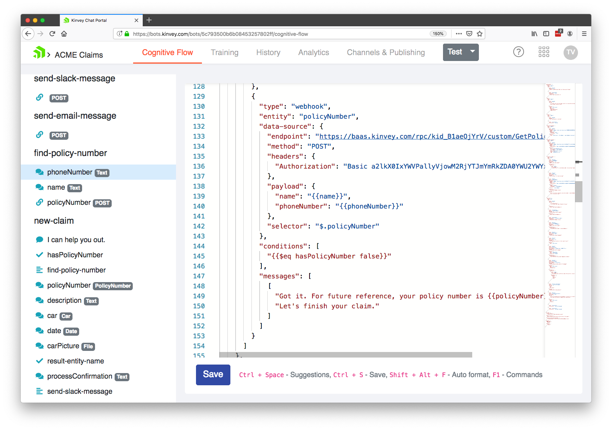
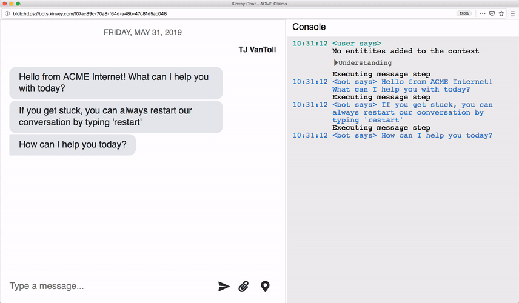
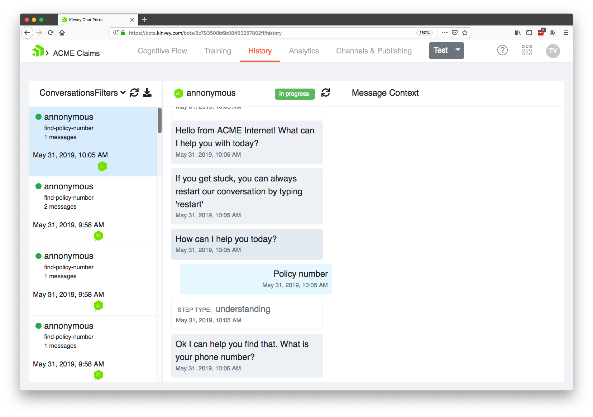
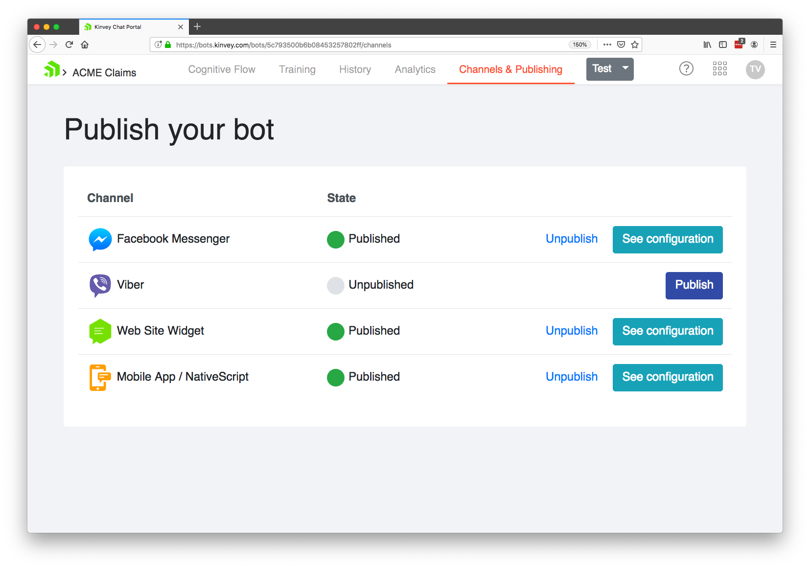

# Building a Customer Service Chatbot

Almost everyone has a list of companies they hate calling. For me it’s my internet service provider, as every interaction with them involves a scripted phone process that takes at least 30 minutes to complete.

Broken support workflows like these are common, and they’re especially frustrating because they don’t work for either the customer or the company. The customer has to take an unreasonable amount of time out of their day, and the company has to hire staff to handle the never-ending stream of support requests.

Chatbots offer an appealing alternative to phone-based support workflows, as you have the ability to automate common requests—cutting down on your staffing requirements, and helping users get the answers they need faster. In this article we’ll look at what chatbots are, how they can help in customer service workflows, and how you can get started today.

## What is a chatbot?

A chatbot is a computer program designed to mic conversation with human users. That program is often powered by rules and artificial intelligence that aim to provide a realistic chat experience.

Chatbots have surged in popularity in the last few years. In fact, Gartner predicts that [25% of customer service operations will use virtual customer assistants (aka chatbots) by 2020](https://www.gartner.com/en/newsroom/press-releases/2018-02-19-gartner-says-25-percent-of-customer-service-operations-will-use-virtual-customer-assistants-by-2020). This is up from 2% in 2017, so the rise of chatbots is staggering to say the least.

## How chatbots can help

Chatbots are especially appealing to organizations struggling to handle customer service workloads, as chatbots can help automate common requests that might be handled by humans today.

For example, one of the most common reasons I call my internet service provider is to schedule a service appointment. There’s no reason a human has to be involved in this process, as today’s chatbot technology can easily be used to guide users through scheduling workflows.

In fact, Gartner’s reports that organizations that implement a VCA (virtual customer assistant) or chatbot [experience a reduction of up to 70 percent in call, chat and/or email inquiries, as well as increased user satisfaction](https://www.gartner.com/en/newsroom/press-releases/2018-02-19-gartner-says-25-percent-of-customer-service-operations-will-use-virtual-customer-assistants-by-2020).

Let’s look at you can get started building chatbots today with Progress Kinvey.

## How to get started

[Progress Kinvey](https://www.progress.com/kinvey) is a platform to help you build modern business apps fast. Kinvey includes a [comprehensive chatbot development platform named Kinvey Chat](https://www.progress.com/kinvey/chat), which is perfect for automating customer service workflows.

To get started with Kinvey Chat, first [sign up for a free Kinvey account](https://console.kinvey.com/sign-up), and then head to the Kinvey Chat portal, at [bots.kinvey.com](https://bots.kinvey.com).

> **NOTE**: In this article we’re going to take a high-level look at how developing bots with Kinvey Chat works. If you want to dive into the details, check out our [comprehensive Kinvey Chat tutorial](https://www.progress.com/kinvey/chat/chatbot-tutorial-intro), which will guide you through building a real-world chatbot from scratch.

What makes Kinvey Chat unique is its approach to helping build bots through what’s known as a cognitive flow. You define Kinvey Chat’s cognitive flow in JSON, which makes it really easy to visually see how a chat works.

For example, suppose you work at an internet service provider, and one common thing users need to do is look up their policy number. Let’s also suppose you need to gather the user’s phone number and name to complete this request. Here’s an example of a Kinvey Chat bot that could fill this need.

Notice how it’s easy to visually see the flow of this conversation. The “find-policy-number” conversation includes a few steps: the first gets the user’s phone number, the second gets the user’s name, and the third (shown below), sends that information to an HTTP endpoint and prints out the user’s policy number.

Kinvey Chat includes hooks for the common customization needs, for example input validation, but what really sets Kinvey Chat apart is how easy it is to train your bot to maximize the success rate of your chat.

For example, to initiate the above policy number conversation, you must define a series of expressions that the user might type, which might look something like this.

As you might expect, when the user asks one of these phrases verbatim, the chatbot initiates the policy number workflow. You can see this in action below.

But, if the user doesn’t type in a phrase verbatim, Kinvey Chat’s built-in artificial intelligence tries to match their input to its training data. For instance, suppose the user came into this chat and simply typed “policy number”.

As you can see, Kinvey Chat was able to determine the user’s likely intent, and the Chat testing console even includes a confidence metric (in this case 78%), to tell you how confidence the chatbot was in its decision. 

Futhermore, Kinvey Chat includes a comprehensive set of history and analytic tools, allowing you to find patterns and further refine your bots to maximize your ratio of successful conversations.

When you’re ready Kinvey Chat gives you a number of deployment options, meaning, you can deploy the same bot to your web sites, mobile apps, and even to chat platforms like Facebook Messenger.

## Next steps

Overall, chatbots are a new and compelling option for helping businesses deal with support backlogs and increase customer satisfaction. Kinvey Chat is a great place to get started building, as it offer an intuitive way to build new bots that automate your existing support workflows.

If you’re interested, [sign up for a free Kinvey account](https://console.kinvey.com/sign-up), and go through our [comprehensive Kinvey Chat tutorial](https://www.progress.com/kinvey/chat/chatbot-tutorial-intro) to help you go beyond the basics and start building powerful bots fast.
