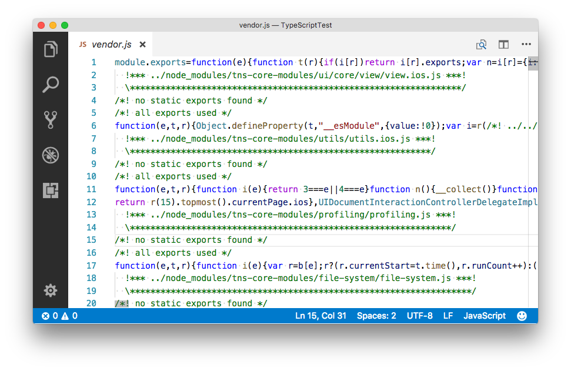

# How to Build NativeScript Apps That Start Up Fast

> Hi! 👋  The article you see here is a draft. It’s destined for the NativeScript documentation, but it needs some technical editing help first. If you have feedback feel free to join the [NativeScript community Slack](http://tinyurl.com/nativescriptSlack) and ping me (@tjvantoll). Thanks!

NativeScript allows you to write native iOS and Android applications using JavaScript. Although there are many advantages to taking this approach—using one language to write multiple apps, faster development times from using an interpreted language, and so forth—there is one fact NativeScript developers can’t avoid: NativeScript apps can take longer to start up than applications written with native development languages such as Objective-C and Java.

Don’t worry though—with a few optimizations, NativeScript apps can startup fast enough for the overwhelming majority of app use cases. This article is a straight-to-the-point list of steps you can take to make sure your NativeScript apps start up as fast as possible. 

> **NOTE**: Jump to the [summary](#summary) if you want an explanation-free list of commands to run.

Let’s get started.

* [Step 1: Enable webpack](#step-1)
* [Step 2: Add uglification](#step-2)
* [Step 3: Perform heap snapshots](#step-3)
* [Summary](#summary)

<h2 id="step-1">Step 1: Enable webpack</h2>

One of the biggest thing that slows down NativeScript apps on startup is file I/O. Every time you do a `require()` call in your app, the NativeScript modules must retrieve a file from your app, and run that file through the [JavaScript virtual machine that NativeScript uses](http://developer.telerik.com/featured/nativescript-works/). That cost adds up, especially in larger apps that might require hundreds or thousands of modules to render their first page.

The best way to reduce this file I/O is to place all of your JavaScript code in a small number of files. For NativeScript apps the best way to do this is [enabling the NativeScript webpack plugin](https://docs.nativescript.org/best-practices/bundling-with-webpack), which gives you the ability to use the popular [webpack](https://webpack.github.io/) build tool to optimize your NativeScript apps.

First you’ll want to install the plugin.

```
npm install --save-dev nativescript-dev-webpack
```

And then run `npm install` to install its dependencies..

```
npm install
```

When the installations complete, you’ll have a series of scripts you can use to build your NativeScript apps with webpack optimizations enabled.

> **NOTE**: Webpack is not enabled by default as it slows down NativeScript’s build processes. Although you’re welcome to use webpack for all your builds, we recommend using webpack only for benchmarking and release builds.

You can go ahead and run one of the following two commands to see how much faster your apps run with the default webpack configuration in place.

```
npm run start-android-bundle
```

Or

```
npm run start-ios-bundle
```

Here’s how fast the default NativeScript apps start with webpack enabled.

<div style="display: flex; max-width: 100%;">
  
  
</div>

> **NOTE**:
> * If you’re having trouble enabling webpack in your own apps, feel free to reach out for help on the [NativeScript community forum](https://discourse.nativescript.org/).
> * If you’re interested in profling your apps to see _exactly_ how big of a difference these optimizations make, check out [this article on profiling NativeScript apps](https://www.nativescript.org/blog/deep-dive-into-nativescript-3.1-performance-improvements), which walks through the topic in detail.

Webpack speeds up your app by placing most of your application in two files—`vendor.js` and `bundle.js`. If you’re curious, you can find those files in your `platforms/ios/NAME_OF_YOUR_APP_/app` folder for iOS, and in your `platforms/android/src/main/assets/app` folder for Android.

Your app should be a lot faster now that you’ve using a lot fewer files, but we’re just getting started. Even though your app is only using a few files, there’s still a cost for NativeScript to parse your JavaScript code. That is, the more lines of JavaScript code in your app, the more time it’ll take NativeScript to interpret that code and get your app up and running.

Luckily webpack has a series of easy-to-add plugins can help.

<h2 id="step-2">Step 2: Add uglification</h2>

Webpack has a number of plugins, but perhaps the most useful plugin is built right into webpack itself—[UglifyJS](https://github.com/mishoo/UglifyJS2). As its name implies, UglifyJS compresses and minifies your JavaScript code to reduce files sizes.

For NativeScript apps using UglifyJS has two main advantages—first because UglifyJS reduces the file size of JavaScript files, it’ll also reduce the file size of your app as a whole. Second, because UglifyJS removes dead code as it minifies your code, your app will start up faster as there will be fewer JavaScript instructions for NativeScript to parse when your app starts up.

Using UglifyJS is easy too. To use UglifyJS as part of your NativeScript builds, all you need to do is add a `--uglify` flag to the scripts you ran earlier. That is, run one of the following commands.

```
npm run start-android-bundle --uglify
```

Or

```
npm run start-ios-bundle --uglify
```

If you open your `vendor.js` and `bundle.js` files, you should now see compressed code that looks something like this.



Your apps should start noticeable faster as well now that NativeScript has less JavaScript code to parse during the startup process. Here’s what the default NativeScript apps looks like with Uglify added to the webpack build process.

<div style="display: flex; max-width: 100%;">
  
  
</div>

To recap our steps so far, you started by enabling webpack, which placed all of your application code into two files. Having your code in two files greatly reduced the file I/O NativeScript has to do when your app starts, and your startup times improved.

Next, you enabled UglifyJS, which reduces the size of your app by removing dead code. Fewer lines of code means less JavaScript for NativeScript to parse when your app starts up, so your startup times improved again.

As a next step you’re going to take things one step further, and register your JavaScript with the JavaScript virtual machine itself.

<h2 id="step-3">Step 3: Perform heap snapshots</h2>

NativeScript runs the JavaScript code you write through a [JavaScript virtual machine](http://developer.telerik.com/featured/a-guide-to-javascript-engines-for-idiots/), which is essentially a piece of software that’s specifically designed to interpret and execute JavaScript code.

NativeScript Android apps run on top of Google’s V8 engine, and NativeScript iOS apps run on top of Apple’s JavaScriptCore engine. V8 has a neat feature called heap snapshots, which NativeScript leverages to give a pretty powerful boost to Android startup times.

Here’s the basics of how heap snapshots work: when you start up your app, normally, the JavaScript VM has to fetch and parse every JavaScript file you use intend to use in your app. There is a cost to doing this, and that cost is one thing that can slow down the startup of your NativeScript apps.

With a V8 heap snapshot you have the ability to seralize the result of that fetching and parsing in a binary file. On subsequent launches, the NativeScript Android runtime knows to look for this binary file. If it finds the file, NativeScript can feed that snapshot to V8 directly, greatly reducing the amount of time it takes for your app to get up and running.

In NativeScript we’re integrated this process directly within our webpack build; therefore, running a build with V8 heap snapshots enabled is as simple as adding a `--snapshot` flag to the previous step.

```
npm run start-android-bundle --uglify --snapshot
```

There are two important things to note:

1) Because heap snapshots are a feature of V8, you can only use this feature as part of your NativeScript Android builds. A similar feature is not available for NativeScript iOS builds.
2) Under the hood the NativeScript snapshot generated uses a V8 tool called `mksnapshot`. The `mksnapshot` tool only supports macOS and Linux, and therefore at the moment you are unable to use the `--snapshot` flag as part of your builds on Windows. Currently, `--snapshot` is a pass through on Windows development machines.

Because heap snapshots completely avoid the need parse the vast majority of your JavaScript on startup, they tend to speed up the startup times of NativeScript apps substantially. Here’s how the default NativeScript app starts up on Android with heap snapshots enabled.


> **NOTE**: For a far more technical explanation of how V8 heap snapshots work in NativeScript, and how you can configure and optimize the snapshots, check out [this article on the NativeScript blog](https://www.nativescript.org/blog/improving-app-startup-time-on-android-with-webpack-v8-heap-snapshot).

> **TJ NOTE**: At this point there are two things I’m considering covering: lazy loading Angular routes, and moving as much code as possible to your `vendor.js` file. I’m torn—both do help your apps start up faster, but both aren’t exactly the easiest things to explain, and the benefits are more marginal. Dunno. I’ll think about this a bit.

<h2 id="summary">Summary</h2>

By enabling webpack, using UglifyJS, and performing V8 heap snapshot builds, you have the ability to greatly improve the startup times of your NativeScript applications. As a reference, here is a brief reference for the commands you need to run to enable all optimizations.

1) Install webpack.

```
npm install --save-dev nativescript-dev-webpack
```

2) Install webpack’s dependencies.

```
npm install
```

3) Run on iOS with webpack and UglifyJS enabled.

```
npm run start-ios-bundle --uglify
```

4) Run on Android with webpack, UglifyJS, and V8 heap snapshot builds enabled.

```
npm run start-android-bundle --uglify --snapshot
```