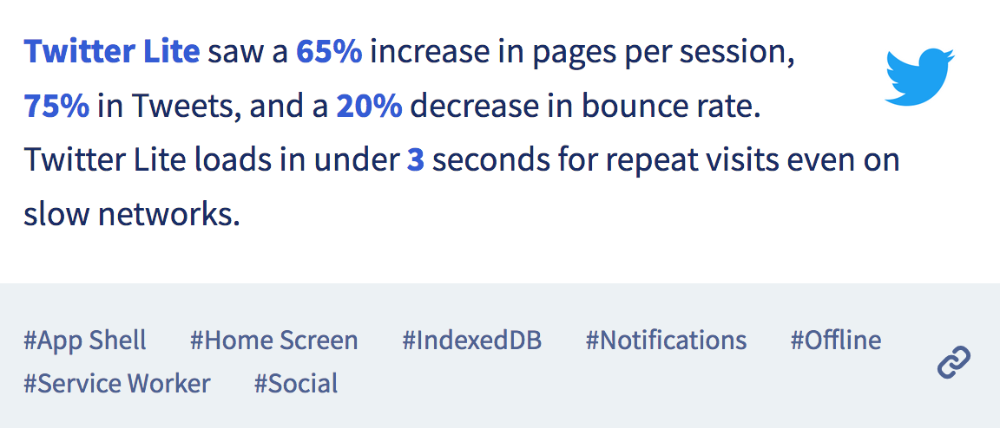

# Choosing Between Progressive Web Apps, React Native, and NativeScript in 2018

If you are a JavaScript developer looking to build a mobile app in 2018, you have never had more options. You can build for the web with a Progressive Web App, build a hybrid app using Cordova, build native iOS and Android apps using frameworks like React Native or Progress’s own NativeScript, or choose some combination of all of these things.

This article will give you clear guidance on which approach makes sense for the app you need to build. You’ll learn about the three most popular options JavaScript developers have for building apps today —Progessive Web Apps, Cordova, and JavaScript-driven native apps—and then you’ll see some innovative ways developers are combining these approaches.

For each option you’ll get some clear guidelines on when the approach makes sense, and when it doesn’t, depending on the application needs. Let’s start the conversation by looking at Progressive Web Apps.

## Option 1: Progressive Web Apps

Progressive Web Apps (PWAs) are a series of new APIs that add a number of new features to web applications. The PWA initiative has received a lot of attention in the JavaScript community in the last year, as Google, Microsoft, and Mozilla have all been pushing the technology heavily through their . It’s hard to attend a JavaScript conference without accidentally attending at least one talk on PWAs.

Why all the hype? PWAs open the door to a lot of really useful functionality for web apps, including the following.

* **Home screen placement**—PWAs can appear on the user’s home screen, just like native mobile applications do.
* **Offline**—PWAs work offline by default, and can employ more advanced caching strategies.
* **Push notifications**—PWAs give web apps the opportunity to send push notifications, even when the web app is not being actively viewed.

This functionality has the power to add a lot of value to a traditional web application. The site [pwastats.com](https://www.pwastats.com/) includes an impressive list of case studies of companies that have not only performance metrics like load time, but also business-centric metrics like conversation customer acquisition rates.

_Twitter Lite case study from pwastats.com_

_Flipkart case study from pwastats.com_

Another factor helping drive PWAs rise is the design of the PWA APIs themselves. A lot of web APIs require potentially complex polyfills or workarounds for browsers that don’t support the new API.

But not PWAs. The two primary technologies that PWAs are built on—service workers, and web application manifest files—are both opt-in by design. That is, your web application can declare a service worker and manifest, and browsers that don’t support those APIs just ignore the declarations.

This design has been key to the success of PWAs, as iOS—aka the second biggest mobile platform out there—still does not support the service worker and web app manifest specifications.

But because the PWA approach doesn’t degrade the experience on platforms that don’t support the necessary APIs, PWAs have been able to succeed where many similar technologies have failed. In fact, [many companies have even seen increased iOS conversion rates by rethinking their mobile experiences using a Progressive Web App](https://medium.com/dev-channel/why-progressive-web-apps-vs-native-is-the-wrong-question-to-ask-fb8555addcbb).

But despite being a well designed technology, PWAs are not the solution for all mobile needs. Although PWAs bring a number of valuable features to web applications, the web 

* **Positives** for PWAs
  * **Easy deployment**—The web is substantially easier to deploy to than native mobile platforms like the iOS App Store and Google Play. Updates are also substantially easier when you inevitably need to get new features and fixes out to your users.
  * **Linkability**—Want your customers or clients to see your app? With PWAs all you need is a link
* **Negatives** for PWAs

* Strengths
  * Easy deployment and updates
  * The broad reach of the web
  * Linkability
  * Graceful degradation
  * Great online resources, tons of conference talks, etc.
  * Small footprint (when compared to native apps)
* Weaknesses
  * Many features aren’t available on iOS (yet).
  * Can’t use all mobile APIs and features.
  * Can be hard to monetize (currently, web payment APIs are in the works)
  * Limited by the performance of the web

## Option 2: Cordova

* Intro & background
  * Stable technology led by Adobe.
  * npm downloads flat but still high compared to competitors.
  * Approach being encroach upon by PWAs as the web catches up.

* Strengths
  * Familiar tech—JS, CSS, HTML, npm
  * Ability to access device APIs through plugins.
* Weaknesses
  * Difficulty of creating plugins
  * Limited by the performance of web views
  * Inability to use native user interface components
  * Painful iOS and Android deployment processes and update cycles

## Option 3: JavaScript-driven native

* Intro & background
  * Big players are React Native and NativeScript
  * Large growth of both in npm in 2017.
  * Show big case studies, like SAP using {N}. Give React Native some shout outs.
  * Expanding to new frameworks, like {N} supporting Vue.

* Strengths
  * Familiar tech—JS, CSS, npm
  * Native-like performance and native user interfaces
  * Unlimited device API access
  * Ability to use iOS and Android SDKs
* Weaknesses
  * Need to learn new markup components to build UI
  * Painful iOS and Android deployment processes and update cycles
  * Large footprint (because they’re native apps)

## Option 4: Web + Native

🌈 🦄

OMG YOU GET THE BEST OF BOTH WORLD AMIRITE!?

* Intro & background
  * Walk over common approaches to this today.
    * Ionic
    * {N}
    * React Native
  * This whole idea works because it’s all just JavaScript.
  * Twitter lite

* Strengths
  * Building for three platforms from one codebase.
* Weaknesses
  * Building for three platforms from one codebase.

Stats to show increased mobile demand?
  https://techcrunch.com/2017/12/05/consumer-spending-across-app-stores-worldwide-to-top-110-billion-in-2018/?utm_campaign=Fuse%2BWeekly&utm_medium=email&utm_source=Fuse_Weekly_106