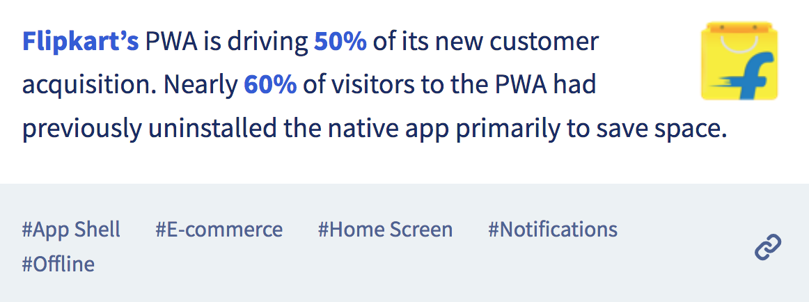
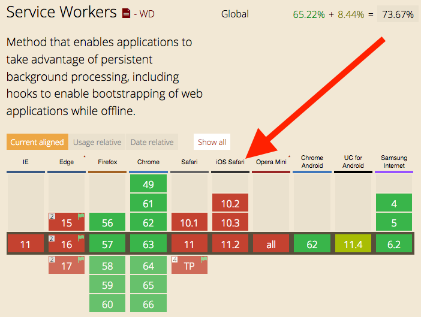
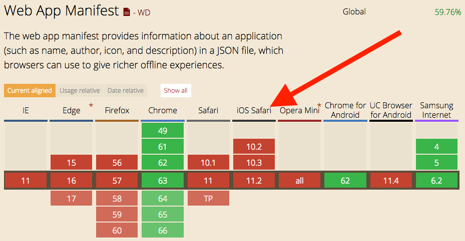
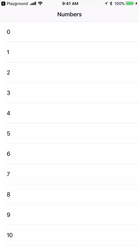
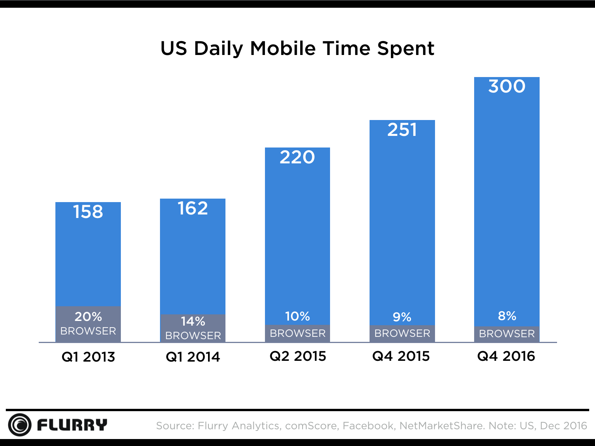

# Choosing Between Progressive Web Apps, React Native, and NativeScript in 2018

If you are a JavaScript developer, you have never had more options for building mobile aps. You can build for the web with a Progressive Web App, build a hybrid app using Cordova, build native iOS and Android apps using frameworks like [NativeScript](https://www.nativescript.org/) or [React Native](https://facebook.github.io/react-native/), or choose some combination of all of these things.

Here at Progress, the two biggest approaches we see as on the rise are Progressive Web Apps, and JavaScript-driven native frameworks like NativeScript and React Native. We get a lot of requests to compare these two approaches to application development, so that will be the focus of this article.

We’ll start by discussing the Progressive Web App and the JavaScript-driven native approaches in detail, and move on to give some clear guidelines on when each approach makes sense. Let’s start the conversation by looking at Progressive Web Apps.

## Progressive Web Apps

[Progressive Web Apps](https://developers.google.com/web/progressive-web-apps/) (PWAs) are a series of new APIs that add a number of new features to web applications. The PWA initiative has received a lot of attention in the JavaScript community in the last year, as Google, Microsoft, and Mozilla have all been pushing the technology heavily through their respective channels. It’s hard to attend a JavaScript conference without accidentally attending at least a few talks on PWAs.

*Snippets from the [Chrome Developer Summit schedule](https://developer.chrome.com/devsummit/schedule). The conference had four PWA-related talks on day 1.*

Why all the hype? The PWA APIs open the door to a lot of really useful functionality for web apps, including the following.

* **Home screen placement**—PWAs can appear on the user’s home screen, just like native mobile applications do.
* **Offline**—PWAs work offline by default, and can employ advanced caching strategies.
* **Push notifications**—PWAs give web apps the opportunity to send push notifications, even when the web app is not being actively viewed.

The site [pwastats.com](https://www.pwastats.com/) includes an impressive list of case studies from companies that have switched to Progressive Web Apps. As the stats show, many of these companies have not only improved performance metrics like load time, but also business-centric metrics like conversation and customer acquisition rates.

For example Twitter was able to decrease bounce rates by 20% by implementing the PWA APIs.

_The Twitter Lite case study from pwastats.com_

And the India-based e-commerce site Flipkart was able to increase its new customer acquisition by 50% using a PWA.

_The Flipkart case study from pwastats.com_

Why have PWAs been so successful when many other attempts to make the mobile web more like native apps have failed?

One reason is the design of the Progressive Web App APIs themselves, as the two primary technologies behind PWAs—service workers and web app manifest files—were designed with graceful degradation in mind. Meaning, you can start using service workers and manifest files files for browsers that support the APIs today, and not worry about breaking your app in browsers that have zero support.

This design has been key to the success of PWAs, as iOS—aka the second biggest mobile platform out there—still does not support the service worker and web app manifest specifications, as the following data from [caniuse.com](https://caniuse.com) shows.

*Browser support data for service workers from [caniuse.com](https://caniuse.com/#search=service%20workers). The noticeable browser with zero support is iOS Safari.*

Despite this, because the PWA approach doesn’t degrade the experience on platforms that don’t support the necessary APIs, PWAs have been able to succeed where many similar technologies have failed.

In fact, [many companies have seen increased iOS conversion rates by rethinking their mobile experiences using a Progressive Web App](https://medium.com/dev-channel/why-progressive-web-apps-vs-native-is-the-wrong-question-to-ask-fb8555addcbb). For example the e-commerce site AliExpress saw a 82% increase in iOS conversion rates with their PWA.

_A [Google case study](https://developers.google.com/web/showcase/2016/aliexpress) showing how the site AliExpress improved their conversation rates with a PWA—even on iOS._

But despite being a well designed technology, PWAs are not the solution for all mobile needs. At the end of the day PWAs are web apps, and as such, they are subject to the same limitations as any web app—such as having limited device API access, and having performance characteristics that are very reliant on the browser they’re running in.

Running on the web brings a ton of advantages as well, of course, and we’ll discuss all of this in more detail when we compare PWAs with JavaScript-driven native approaches momentarily. For now let’s first take a look at how JavaScript-driven native frameworks like NativeScript and React Native work.

## JavaScript-driven native

Years ago, JavaScript developers that wanted to build for iOS and Android were forced to learn completely new languages and development approaches. The first technology to change this was Cordova, which allowed web developers to package their web apps into a native binary, and to access device APIs through plugins.

Since Cordova was first released, developers have created a variety of alternative approaches to use JavaScript to drive native iOS and Android applications. In this article we’re going to cover the latest of these approaches, which we call [JavaScript-driven native](https://developer.telerik.com/featured/defining-a-new-breed-of-cross-platform-mobile-apps/).

What separates JS-driven native frameworks from Cordova-based approaches is that JS-driven native frameworks use native user interface components, and therefore abandon web concepts like HTML and the DOM. For example, the following gif shows off a sample NativeScript app in action.

_The [NativeScript examples app](https://www.nativescript.org/nativescript-example-application), which you can try for yourself by searching for “NativeScript Examples” in the iOS App Store or Google Play._

This approach was popularized in 2015 by the releases of Facebook’s React Native, and Progress’s NativeScript, which today are the two most popular frameworks for building JavaScript-driven native apps.

[_Insert State of JS 2017 survey results here to prove the previous point. Maybe include npm downloads to further solidify the argument._]

For JavaScript developers, using native user interface components to build your applications is both a great and a horrible thing. It’s great because using native iOS and Android UI components means your applications automatically look right on the platforms you’re building for. You don’t have to worry about styling your app to make your navigation bar look like a `UINavigationBar` on iOS or a `Toolbar` on Android, because you’re using those elements already.

For example, here is how the NativeScript `<ActionBar>` UI component renders on iOS and Android.

_The NativeScript `<ActionBar>` component renders a `UINavigationBar` on iOS (left), and as a `Toolbar` on Android (right)._

Using native user interface components also means you can leverage some really powerful native constructs that aren’t present on the web. For example, suppose you want to build an endless scrolling list with tens of thousands of items. On the web you have to concern yourself with non-trivial concepts like virtual DOMs to avoid performance problems. But in native apps, iOS and Android both provide list controls that automatically handle the tasks of memory management for you. For example, here’s how a list in NativeScript performs if you casually throw 50,000 items in it (notice how little the scroll bar on the right moves).

_A NativeScript app that lists 50,000 items. You can [see the source code for this app and try it for yourself on the NativeScript Playground](https://play.nativescript.org/?template=play-js&id=ieaS3B)._

That’s not to say that using native iOS and Android user interface components is perfect. The downside of using native UI components, especially for JavaScript developers, is that you have a new set of components to learn. For instance, to build the example in the previous gif you would have to learn how a `<ListView>` works in NativeScript, or how a `<FlatList>` works in React Native. And if you want to customize your lists beyond what frameworks like NativeScript and React Native offer out of the box, you’ll have to deal with the not-especially-intuitive iOS and Android APIs that make these controls possible.

At the end of the day, JavaScript-driven native apps are native apps, and so they also suffer many of the same difficulties inherent to native iOS and Android development. To discuss some of these limitations in detail, let’s shift our discussion to comparing PWAs to JavaScript-driven native apps directly.

## Which to choose

Now that we’ve introduced both approaches to JavaScript app development, let’s tackle the hard question: what platform should you build your next app on?

For most situations your default platform should be the web, and therefore your default mobile app choice should be a PWA. The web is far easier to build for and deploy to than native apps; the web lets you reach more users because you don’t have to deal with app stores; and the web makes it easier for users to access your apps because of URLs.

That being said, the web is not the best choice for all app usage scenarios. Although there are many situations where it makes sense to build a native app, the single biggest reason is that you need to do something the web simply can’t do.

Whenever I make this argument to web advocates I’m inevitably sent to a 

---

Although the list of things the web can do today is pretty impressive, the web can’t keep up with what native platforms make possible. If you want to work with IoT devices, build 

Furthermore, even in cases where the web and native both allow a particular piece of functionality, you can almost always do more with that functionality in native applications.

For example, both the web and JavaScript-driven native apps allow you to use a device’s camera to take a picture. But native applications let you go farther, and customize the camera to make a variety of additional use cases possible. If you’ve ever used a banking app to deposit a check, you’ve seen this functionality in action.

-- image of check app

Little tweaks like putting an overlay on the camera can be enormously valuable for the user, and can drive real engagement for your application. And it’s not just the camera, this same pattern repeats itself with many other common mobile APIs. For example web and native applications both have access to a users location, but native apps can track a user’s location while your app is in the background, meaning Google Maps can continue to track you while take a phone call.

The great thing about JavaScript-driven native frameworks is they make this sort of advanced mobile functionality possible while sticking to a web-friendly workflow. For example you can easily find background geolocation plugins for both React Native and NativeScript with a quick Google search.

* Do you need to make money off your app directly?

Consumers spending across app stores is [expected to top $110 billion in 2018](https://techcrunch.com/2017/12/05/consumer-spending-across-app-stores-worldwide-to-top-110-billion-in-2018/?utm_campaign=Fuse+Weekly&utm_medium=email&utm_source=Fuse_Weekly_106), so despite intense competition, there’s still money to be made by making applications.

And if your app needs to take user’s money directly, either through charges for the app itself or for in-app purchases, it’s a whole lot easier to take that money using a JavaScript-driven native app.

The [web payment API](https://developers.google.com/web/fundamentals/payments/) exists now, which is exciting, but web payments are still [only supported in some browsers](https://caniuse.com/#feat=payment-request). For native apps, many users already have a credit card registered with Apple or Google, so taking a user’s money is as easy as making an in-app payment request.

In NativeScript, for example, there are plugins for [in-app purchasing](https://market.nativescript.org/plugins/nativescript-purchase), [for PayPal](https://market.nativescript.org/plugins/nativescript-paypal), and [for Stripe](https://market.nativescript.org/plugins/nativescript-stripe)—each of which you can easily install and use in an app.

## Web or native—why not both?

Although PWA advocates like to say that all apps should be web apps, and iOS and Android advocates like to claim that all apps are best made with native code, the truth is each platform has a unique set of advantages. Luke Wroblewski might have [said it best in a 2016 article](https://www.lukew.com/ff/entry.asp?1954).

> “The Web is for audience **reach** and native apps are for **rich** experiences. Both are strategic. Both are valuable. So when it comes to mobile, it's not Web vs. Native. It's both.”

No one is going to argue that the web doesn’t have a greater reach. Because the web runs on all devices around the world, web applications aren’t restricted to app stores run by companies like Apple and Google.

But it might be hard for web advocates to shallow just how much time users spend in native iOS and Android applications. [Data from Flurry Analytics](http://flurrymobile.tumblr.com/post/157921590345/us-consumers-time-spent-on-mobile-crosses-5) for example shows that mobile browser usage in the United States has fallen to a staggeringly low 8% of user’s time.

Yes, this is only US data, and yes, most of this time is spent in a handful of apps like Facebok and Twitter—but still 92% versus 8% is an absolutely enormous gap in usage.

But there’s good news here: because of the rich in JavaScript-driven native frameworks, it’s now possible to build for both platforms using the same development language. You can even use the same framework, as React Native lets you use React and NativeScript lets you use Angular or Vue.

One big trend we at Progress saw in 2017 was developers increasingly trying to build PWAs and native apps using not only the same language, but the same codebase. The NativeScript community has been hard at work creating a bunch of tooling to enable this exact sort of workflow.

[Team Maestro’s Angular NativeScript seed](https://github.com/TeamMaestro/angular-native-seed) is the most popular of these options, and it provides a number of conventions and CLI scripts that simplify the process of building for multiple platforms.

-- picture --

The React Native world is experimenting with a number of solutions to enable this exact same sort of workflow using React instead of Angular. The [React Native for Web] project allows developers to render their react native projects on the web, and currently has well over six thousand stars on GitHub.

-- picture --

From a business perspective these approaches make a lot of sense, as the ability to consolidate your application development to one team and one language has the potential to save you a lot of time and hassle.

That’s not to say these approaches are perfect by any means. Android, iOS, and the web are different platforms with different conventions 

## Wrapping up

In 2017 the biggest trends we at Progress see in the JavaScript mobile world are the rises of both Progressive Web Apps and JavaScript-driven native apps.

Progressive Web Apps bring a series of features that make web apps feel more like native apps, and JavaScript-driven native frameworks allow you to use JavaScript to build completely native iOS and Android apps using native user interface components and APIs.

Which approach you want to use depends on your own application needs. Starting with a Progressive Web Apps makes a lot of sense unless your apps needs APIs or features of native development platforms. Building for _both_ web and native is growing trend, as it enables you to leverage the best features of each platform.
