# How to Get Started With Kinvey and NativeScript—Fast

[NativeScript](https://www.nativescript.org/) allows you to build native iOS and Android apps from a single codebase, and [Progress Kinvey](https://www.progress.com/kinvey) makes it easy to add the backend plumbing that makes your app work. Together, the two technologies let you build modern mobile apps fast.

In this article we’ll take an opinionated look at how to get up and running with NativeScript and Kinvey as fast as possible. If you follow along through the whole article, you’ll set up a new Kinvey account, configure a NativeScript development environment, and start to take advantage of some of the powerful backend features Kinvey offers. At the end you’ll have an app that looks like this:


Let’s get started.

* [Step 1: Set up your Kinvey account](#step-1)
* [Step 2: Set up your NativeScript environment](#step-2)
* [Step 3: Connect your NativeScript app to your Kinvey account](#step-3)
* [Step 4: Configure your auth](#step-4)
* [Step 5: Configure your data](#step-5)
* [Step 6: Use your data](#step-6)
* [Step 7: Do cool stuff](#step-7)

<h2 id="step-1">Step 1: Set up your Kinvey account</h2>

First things first, to use Kinvey you first need to create a free Kinvey account. To do so, head to [console.kinvey.com/signup](https://console.kinvey.com/signup) and provide your email and a password to register.

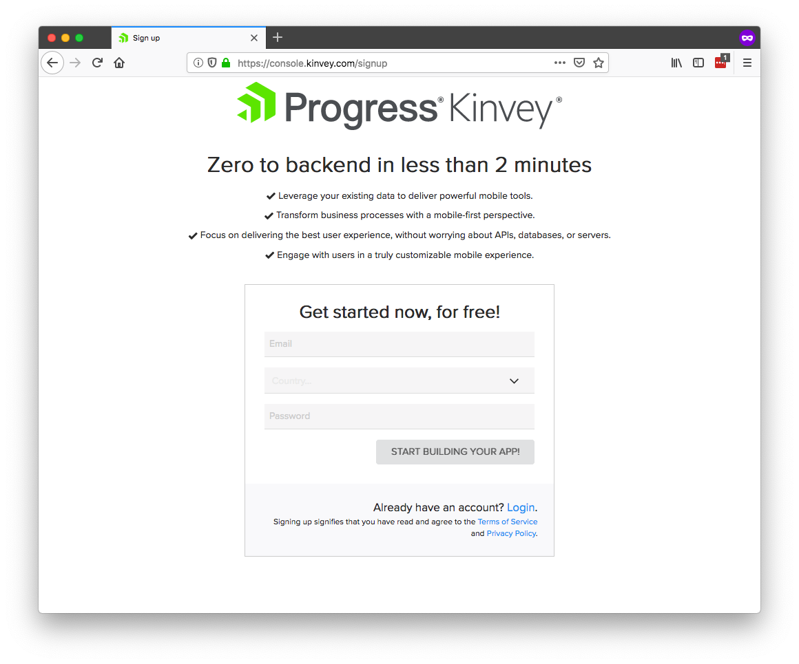

After you have an account, Kinvey will prompt you to create a new app. You can name your app whatever you’d like, but if you’d like to follow along with this article, create a new app named **Tasks**. (You can create additional apps at any time.)


After you create your app, Kinvey will next ask what client platform you’d like to use.

You can use Kinvey on many different platforms (and switch between those platforms at any time), but for this article we’ll stick with NativeScript, so go ahead and select the **NativeScript** platform and click **Continue**.


> **TIP**: [Check out the Kinvey documentation](https://devcenter.kinvey.com) to learn about using Kinvey in other environments, such as in your web apps.

Finally, on the next screen, copy your app key and app secret, and paste them somewhere convenient. (If you do lose these keys, I’ll show you where to find them again later in this article.)


And with that, you now have your Kinvey account set up and a new app ready to go. We’ll return to Kinvey later to start to leverage its features, but for now, let’s shift over to getting your NativeScript environment ready.

<h2 id="step-2">Step 2: Set up your NativeScript environment</h2>

NativeScript is a framework for building iOS and Android apps using JavaScript, and, as such, to start using NativeScript you must set up an environment to write your code.

There are a few different ways to do this, but the easiest—and the one we’ll use for this article—is NativeScript Playground. [NativeScript Playground](https://play.nativescript.org/) is a browser-based environment for developing NativeScript apps without installing any local dependencies. All you need is an iOS or Android device.

Go ahead and visit Playground in your browser of choice. You should see a screen that looks like this.

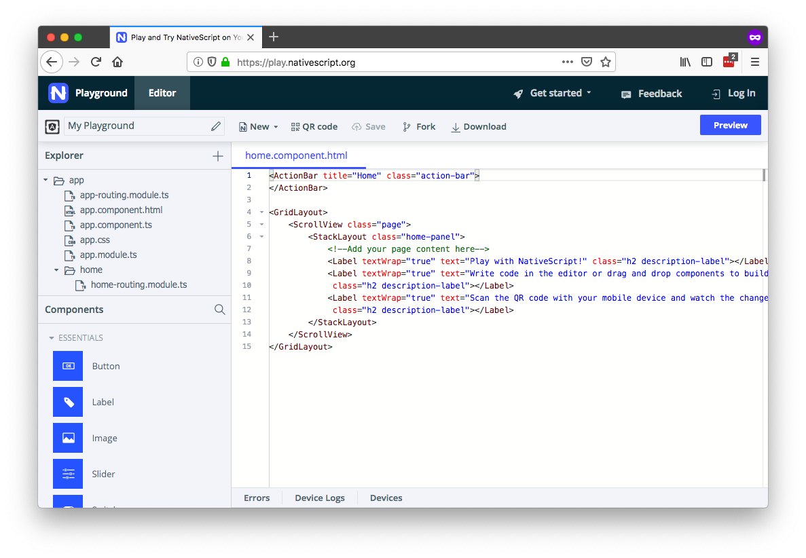

> **NOTE**: If you plan to submit apps to the iOS App Store or Google Play, you’ll eventually need to set up a local NativeScript environment using either the [NativeScript CLI](https://docs.nativescript.org/angular/start/quick-setup) or [NativeScript Sidekick](https://www.nativescript.org/nativescript-sidekick). But Playground has everything you need to get started, and we highly recommend using it when you’re first learning NativeScript and Kinvey.

To start developing in Playground, you need to download and install two apps on an iOS or Android device—**NativeScript Playground** and **NativeScript Preview**.

You can find the apps by searching for “NativeScript Playground” and “NativeScript Preview” in the iOS App Store or Google Play, or by using the links below.

* NativeScript Playground
    * [iOS](https://itunes.apple.com/us/app/nativescript-playground/id1263543946?mt=8&ls=1)
    * [Android](https://play.google.com/store/apps/details?id=org.nativescript.play)
* NativeScript Preview
    * [iOS](https://itunes.apple.com/us/app/nativescript-preview/id1264484702?mt=8)
    * [Android](https://play.google.com/store/apps/details?id=org.nativescript.preview)

Once you have those two apps installed on your device and ready to go, open the NativeScript Playground app on your device and tap the **Scan QR code** button.


Next, in your browser, find and click the **QR code** button (shown in the screenshot below). This brings up a QR code that you can scan using the Playground app on your device.


After you scan the QR code, you should see the following UI on your iOS or Android device.

<div style="display: flex;">
  
  
</div>

> **TIP**: You can connect multiple devices to a NativeScript Playground app and develop on them simultaneously. To do so, just install the NativeScript Playground and NativeScript Preview apps on multiple devices and scan the QR code on all of them.

And with that, you’re ready to start developing NativeScript apps!

If you’d like, you can experiment by changing the default app’s code in the Playground environment. As soon as you save changes, your device will refresh and you’ll be able to see your updates in action right away.

Now that you have a Kinvey account set up and a NativeScript environment ready, let’s look at how to connect the two technologies.

<h2 id="step-3">Step 3: Connect your NativeScript app to your Kinvey account</h2>

The easiest way to connect NativeScript apps to Kinvey functionality is through the [Kinvey SDK for NativeScript](https://github.com/Kinvey/nativescript-sdk), which provides a series of easy-to-use JavaScript APIs. NativeScript Playground includes the Kinvey SDK in every app you build, so you can immediately start using the SDK APIs with no additional setup necessary.

The first API you need to use is `Kinvey.init()`, which is the method that makes the connection from your NativeScript front end to your Kinvey backend. Remember the code snippet you copied during the Kinvey sign-up process earlier? That code is a call to `Kinvey.init()` with the values you need to make the connection. It looked like this but it included your `appKey` and `appSecret` values:

```
Kinvey.init({
  ...
});
```

As a next step, you could take this code and paste it into your current Playground app and be on your way, as, after all, all Playground apps support the Kinvey SDK out of the box.

That being said, personally I like starting from a more complete app template that has a bit of scaffolding to make my life easier. My personal favorite starting point for NativeScript and Kinvey apps is the “Good-Looking Login Form” example from the [NativeScript Marketplace’s code sample listing](https://market.nativescript.org/?tab=samples&framework=all_frameworks&category=all_samples).


It’s a simple app, but it has a pre-built Kinvey-based login form, as well as some of the basic setup necessary to build multi-page NativeScript apps.

Therefore, to follow along with this article, go ahead [open the login form sample](https://play.nativescript.org/?template=play-ng&id=Hqp5UQ&v=2973) in your browser, and scan that app’s QR code on your device.

> **NOTE**: The version of the sample we’ll be using is Angular-based, but if you’re a Vue.js fan, you can use [this Vue.js-based version of the same login sample](https://play.nativescript.org/?template=play-vue&id=HdDm9M&v=786).

Next, open the sample’s `shared/backend.service.ts` file, find the `kinveyAppKey` and `kinveyAppSecret` properties, and replace those properties’ values with the values you copied from your Kinvey backend earlier. If you lost those keys, you can find them using the three dots next to your app’s name in [the Kinvey console](https://console.kinvey.com).


With those values in place, you have now made the connection between your NativeScript front end and your Kinvey backend. Now that you’re done with the setup, let’s look at how to start using Kinvey to do some awesome stuff.

> **TIP**: If you have the NativeScript CLI or NativeScript Sidekick set up, there are additional Kinvey-based templates you can start new apps from. To see them, head to the [NativeScript Marketplace’s template listing](https://market.nativescript.org/?tab=templates&category=all_templates) and search for “Kinvey”.

<h2 id="step-4-">Step 4: Configure your auth</h2>

Authorization and user management are often some of the more _fun_ requirements of your average app, but Kinvey makes them easy. In fact, the sample app you’re using already has a fully functional user management system.

To test it, open your app on your device, tap **Sign up**, and register a new user. After you do, you should see a screen that looks like this.


To confirm the registration worked, head to the [Kinvey Console](https://console.kinvey.com), and click the **Users** option in the navigation. Here, you should see the new user you just registered.

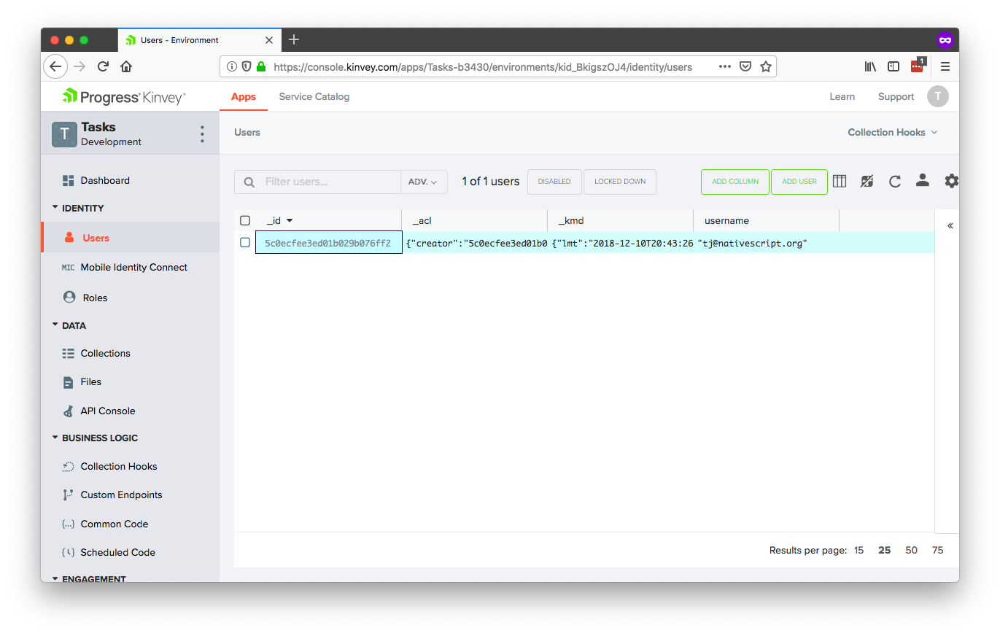

There are a few things you can do to customize how user management for your apps works. To see a few of them, head to the user settings in Console using the button shown in the screenshot below.

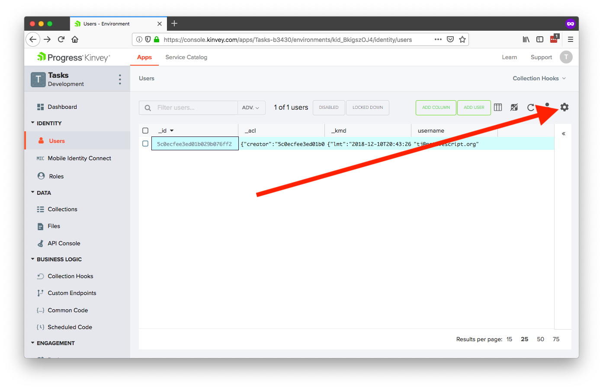

On the **Email Verification** portion of the settings, you can control whether users need to verify their email addresses before logging in, and customize the emails Kinvey will send out on your behalf.

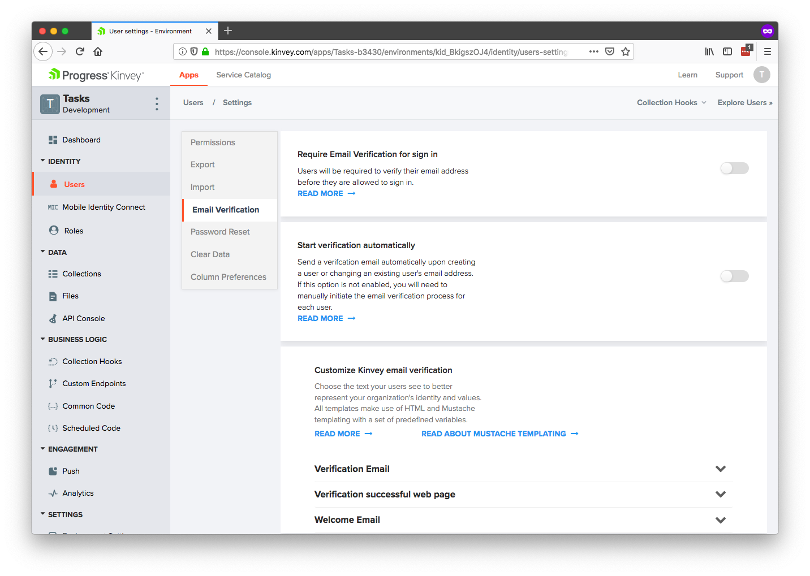

On the **Password Reset** portion of the settings you can similarly configure your password reset processes, or, just let Kinvey take care of everything for you.

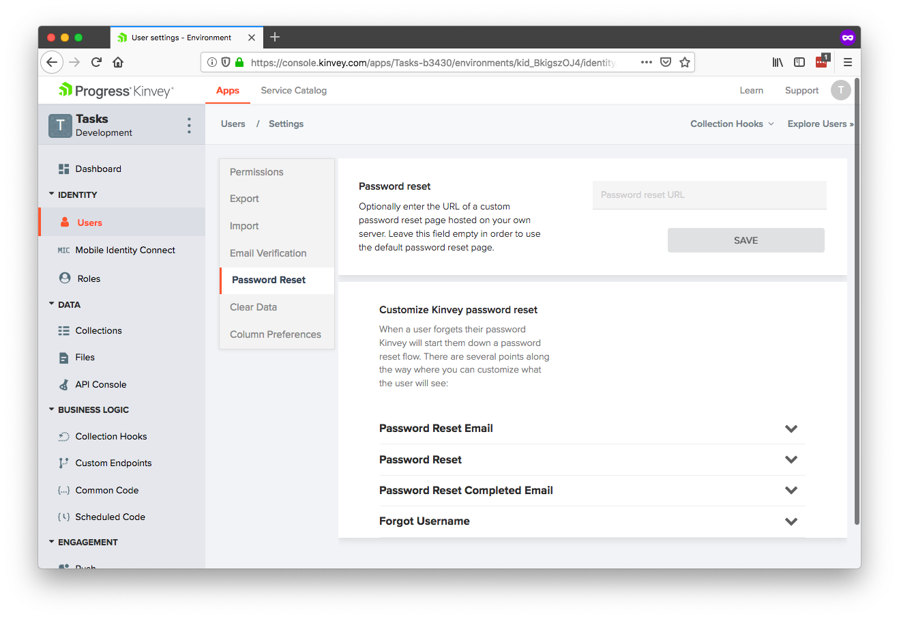

While all of this is functionality is powerful, perhaps Kinvey’s most powerful feature is its **Mobile Identity Connect**, which allows you to connect to a wide variety of existing authentication providers, such as LDAP, Active Directory, Facebook, or really, any provider that supports common protocols like SAML, OpenID, or OAuth.

A full in-depth discussion of Mobile Identity Connect is out of the scope of this article, but if you’re interested, check out [Kinvey’s documentation on setting up MIC](https://devcenter.kinvey.com/nativescript/guides/mobile-identity-connect#) or this [tutorial by Brian Rinaldi](https://www.progress.com/blogs/enterprise-authentication-kinvey). When you’re done, you’ll be able to leverage your existing auth provider directly in your apps. For example, here’s what the workflow looks like with an Active Directory setup.


> **NOTE**: You can [view the source of the above application on GitHub](https://github.com/ignaciofuentes/nativescript-acme-sample/) if you’re looking for a high-quality NativeScript and Kinvey sample to reference.

Regardless of how you choose to implement authentication for your apps, Kinvey has you covered. When you’re all set, let’s move on to look at how you can start to leverage data from Kinvey.

> **TIP**: For a more in-depth look at how users work in Kinvey, check out [_Understanding Users in Kinvey_](https://www.progress.com/blogs/understanding-users-kinvey) by Brian Rinaldi.

<h2 id="step-5">Step 5: Configure your data</h2>

Now that you have Kinvey and NativeScript set up, and you have your user management in place, let’s look at how to work with data.

In Kinvey the building blocks for working with data are called Collections, and you can find yours in the Kinvey Console by tapping on the Collections link shown in the screenshot below.

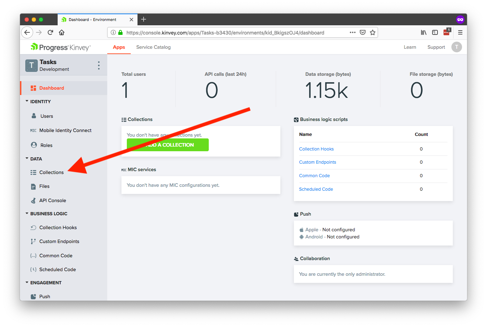

To start working with data you need to create collections, so let’s do just that by clicking the **Add a Collection** button.

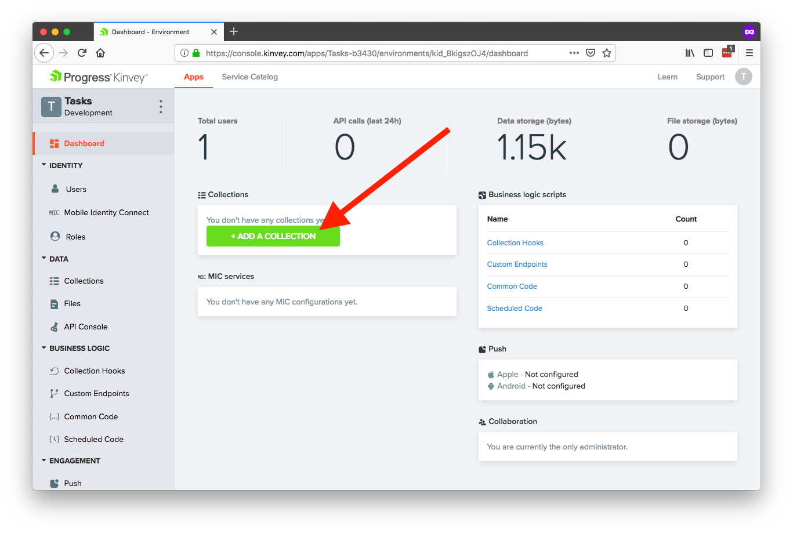

Give your collection a name (use “Tasks” if you want to follow along with this article), and then tap **Save**.


On the next screen you’ll see a UI allows you to select between Kinvey’s built-in cloud-based data store, and Kinvey’s data connectors, which allow you to connect to data you already have.

Kinvey data connectors are known as _RapidData_, and they’re worth checking out if you have existing data in [SharePoint](https://devcenter.kinvey.com/nativescript/guides/rapid-data#ConnectorforSharePoint), [SQL Server](https://devcenter.kinvey.com/nativescript/guides/rapid-data#ConnectorforMicrosoftSQLServer), [Salesforce](https://devcenter.kinvey.com/nativescript/guides/rapid-data#ConnectorforSalesforce), [SAP](https://devcenter.kinvey.com/nativescript/guides/rapid-data#ConnectorforSAP), or if you have [existing REST APIs](https://devcenter.kinvey.com/nativescript/guides/rapid-data#ConnectorforRESTAPIs). For the purposes of this article we’ll keep things simple, and use Kinvey’s built-in data for the new “Tasks” collection you just started.

As one last step before we use this collection, let’s configure its permissions. Kinvey offers a robust set of role-based permissions that determine which users are able to access collections, and also what actions they’re allowed to take on that data. To enter this configuration for your new collection, find and click the gear icon in the Kinvey Console UI (see screenshot below).

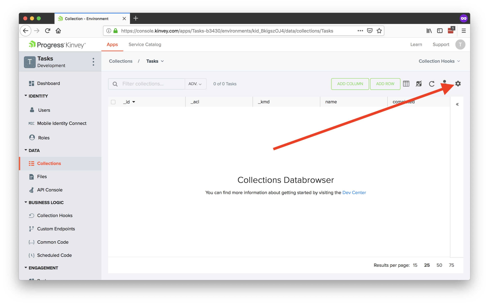

On the following screen, first click the permissions menu option, and then, the pencil that allows you to change your collection’s default permissions.


On this screen you can view and change your new collection’s permissions for creating, reading, updating, and deleting. Find the read dropdown, change its value from **Grant** to **Entity**, and then click the **Update Role Access** button. This makes it so that users can only read tasks that they created, and not other users tasks.

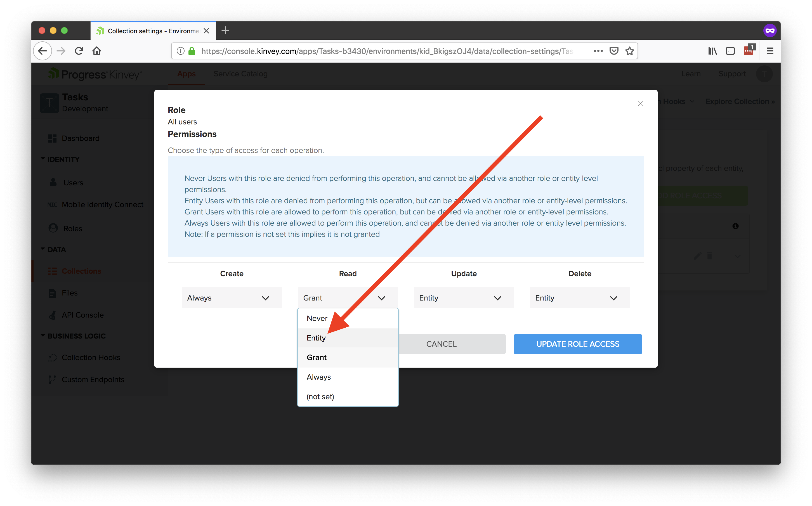

> **TIP**: You can [read a detailed write up on exactly how access control works in Kinvey in the Kinvey docs](https://devcenter.kinvey.com/nativescript/guides/security#).

And with that your collection is now setup and ready to go. In the next step let’s look at how you can use your new collection in your app.

<h2 id="step-6">Step 6: Use your data</h2>

Like with authentication, using Kinvey data in NativeScript apps is as easy as making a few simple calls to the Kinvey SDK. To see this, head back to your app in NativeScript Playground.

There are a few changes you need to make to use your new collection. Start by creating a new `tasks.service.ts` file in your app’s `shared` folder. In Playground, you can do this by giving focus, to the `shared` folder, clicking the **+** button in the explorer, and selecting **Add File** and then **TypeScript**.


Paste the following code into your new `tasks.service.ts` file, which creates a simple service for interacting with your Tasks collection using the Kinvey SDK.

``` TypeScript
import { Injectable } from "@angular/core";
import { Kinvey } from "kinvey-nativescript-sdk";

@Injectable()
export class TasksService {
    private dataStore;

    constructor() {
        this.dataStore = Kinvey.DataStore.collection("Tasks");
    }

    get() {
        const query = new Kinvey.Query();
        // Sort by descending “entity created time” to put new items on top.
        query.descending("_kmd.ect");
        return this.dataStore.find(query);
    }

    save(task) {
        return this.dataStore.save(task);
    }

    handleErrors(error: Kinvey.BaseError) {
        console.error(error.message);
        return Promise.reject(error.message);
    }
}
```

It’s worth taking a moment to appreciate just how simple the Kinvey SDK makes it to interact with your data. Retrieving data is as easy as calling `find()` and updating data is as easy as calling `save()`. (Check out your app’s `user.service.ts` file if you want to see how simple Kinvey makes it to handling the authentication features we looked at in this article’s previous step.)

Next, open your app’s `app.module.ts` file and add your new `TasksService` as a provider. The full code should look like this.

``` TypeScript
import { NgModule, NgModuleFactoryLoader, NO_ERRORS_SCHEMA } from "@angular/core";
import { NativeScriptModule } from "nativescript-angular/nativescript.module";
import { NativeScriptHttpClientModule } from "nativescript-angular/http-client";
import { NativeScriptFormsModule } from "nativescript-angular/forms";

import { AppRoutingModule } from "./app-routing.module";
import { AppComponent } from "./app.component";
import { LoginComponent } from "./login/login.component";

import { UserService } from "./shared/user.service";
import { TasksService } from "./shared/tasks.service";

@NgModule({
    bootstrap: [
        AppComponent
    ],
    imports: [
        NativeScriptModule,
        NativeScriptFormsModule,
        NativeScriptHttpClientModule,
        AppRoutingModule
    ],
    declarations: [
        AppComponent,
        LoginComponent
    ],
    providers: [
        UserService,
        TasksService
    ],
    schemas: [
        NO_ERRORS_SCHEMA
    ]
})
export class AppModule { }
```

> **TIP**: Need help learning the Angular syntax in this code? Check out [our NativeScript Angular tutorial in NativeScript Playground](https://play.nativescript.org/?template=groceries-ng&tutorial=groceries-ng&autoStart=true).

Now that you have a service for working with your Kinvey Collection ready to go, you have to alter your app to use it. To do so, open your `home.component.ts` file and replace its contents with the following code.

``` TypeScript
import { Component, OnInit } from "@angular/core";
import { RouterExtensions } from "nativescript-angular/router";
import { alert } from "tns-core-modules/ui/dialogs";

import { TasksService } from "../shared/tasks.service";
import { UserService } from "../shared/user.service";

declare var UITableViewCellSelectionStyle: any;

@Component({
    selector: "app-home",
    moduleId: module.id,
    templateUrl: "./home.component.html",
    styleUrls: ['./home.component.css']
})
export class HomeComponent implements OnInit {
    tasks = [];
    textFieldValue = "";

    constructor(private userService: UserService, private tasksService: TasksService, private routerExtensions: RouterExtensions) {
    }

    ngOnInit(): void {
        this.tasksService.get().subscribe((data) => {
            this.tasks = data;
        }, () => {
            alert({
                title: "Tasks",
                message: "An error occurred retrieving your data"
            });
        });
    }

    onItemLoading(args) {
        if (args && args.ios) {
            // Prevent default iOS behavior of highlighting a tapped item in a UITableView
            // See https://stackoverflow.com/questions/46299915/remove-listview-item-highlight-on-tap-nativescript-angular-ios
            args.ios.selectionStyle = UITableViewCellSelectionStyle.None;
        }
    }

    onTaskCircleTap(task) {
        const index = this.tasks.indexOf(task);
        this.tasks[index].completed = !this.tasks[index].completed;
        this.tasksService.save(task);
    }

    onReturnPress() {
        if (this.textFieldValue.trim() !== "") {
            this.onButtonTap();
        }
    }

    onButtonTap() {
        if (this.textFieldValue.trim() === "") {
            alert({
                title: "Tasks",
                message: "Please input a task.",
                okButtonText: "OK"
            });
            return;
        }

        var task = {
            name: this.textFieldValue,
            completed: false
        };

        this.tasksService.save(task).then((newTask) => {
            this.tasks.unshift(newTask);
        })
        this.textFieldValue = "";
    }

    logout() {
        this.userService.logout();
        this.routerExtensions.navigate(["/login"], { clearHistory: true });
    }
}
```

There’s a bit of code here that requires some background in NativeScript to understand. If you’re new to NativeScript and having trouble following along with some of the syntax, it might be worth taking a minute to [go through the NativeScript getting started tutorial on NativeScript Playground](https://play.nativescript.org/?template=groceries-ng&tutorial=groceries-ng&autoStart=true).

The code that interacts with your new service is pretty straightforward though. To see them, make note of the call to `tasksService.get()` when your component loads, and the call to `tasksService.save()` when chooses to add a new task.

To define the UI for this app, open your `home.component.html` file, and replace its contents with the following markup, which builds a list UI for working with your tasks collection.

``` XML
<ActionBar title="" flat="true">
    <ActionItem text="Logout" (tap)="logout()" ios.position="right">
        <Label text="Logout" color="white"></Label>
    </ActionItem>
</ActionBar>

<GridLayout rows="auto, auto, *">
    <Label row="0" class="header" text="My Tasks"></Label>

    <GridLayout row="1" class="input-bar" rows="auto" columns="auto, *">
        <Button id="add-task-button" class="list-entry-icon" col="0" text="+"
            (tap)="onButtonTap()"></Button>
        <TextField col="1" [(ngModel)]="textFieldValue" hint="Type new task..."
            editable="true" returnKeyType="done" (returnPress)="onReturnPress()"></TextField>
    </GridLayout>

    <ListView row="2" [items]="tasks" (itemLoading)="onItemLoading($event)">
        <ng-template let-item="item">
            <GridLayout columns="auto, *" class="list-entry" [class.completed]="item.completed">
                <Label col="0" (tap)="onTaskCircleTap(item)" class="list-entry-icon"
                    text=""></Label>
                <Label col="1" class="list-entry-text" [text]="item.name"></Label>
            </GridLayout>
        </ng-template>
    </ListView>
</GridLayout>
```

And finally, so that this app looks polished, paste the following code into your `home.component.css` file, which styles the UI controls you just added.

``` CSS
ActionBar {
    background-color: #35495E;
}
ActionItem {
    color: white;
}

.header {
    background-color: #35495E;
    color: white;
    font-size: 34;
    font-weight: 600;
    padding: 0 15 15 15;
    margin: 0;
}

.input-bar {
    border-width: 0 0 1 0;
    border-color: #E0E0E0;
}
TextField {
    font-size: 16;
    color: black;
    placeholder-color: #C1C1C1;
    padding-left: 0;
}
#add-task-button {
    margin: 15 10 15 15;
    padding-bottom: 3;
}

.list-entry {
    padding: 15;
}
.list-entry-icon {
    width: 30;
    height: 30;
    color: #42B883;
    font-size: 25;
    border-color: #42B883;
    border-width: 2;
    border-radius: 50;
    margin-right: 10;
}
.completed .list-entry-icon {
    background-color: #42B883;
}
.list-entry-text {
    font-size: 17;
    vertical-align: middle;
    color: #35495E;
}
.completed .list-entry-text {
    text-decoration: line-through;
    color: #D3D3D3;
}
```

Save all these changes, and you should now see the following UI on your device for managing tasks.


And what’s cool, is that if you look at your Kinvey backend, you’ll see that all your changes are saved there as well—even if you used Kinvey’s RapidData to connect to an existing data store like Salesforce or SQL Server.

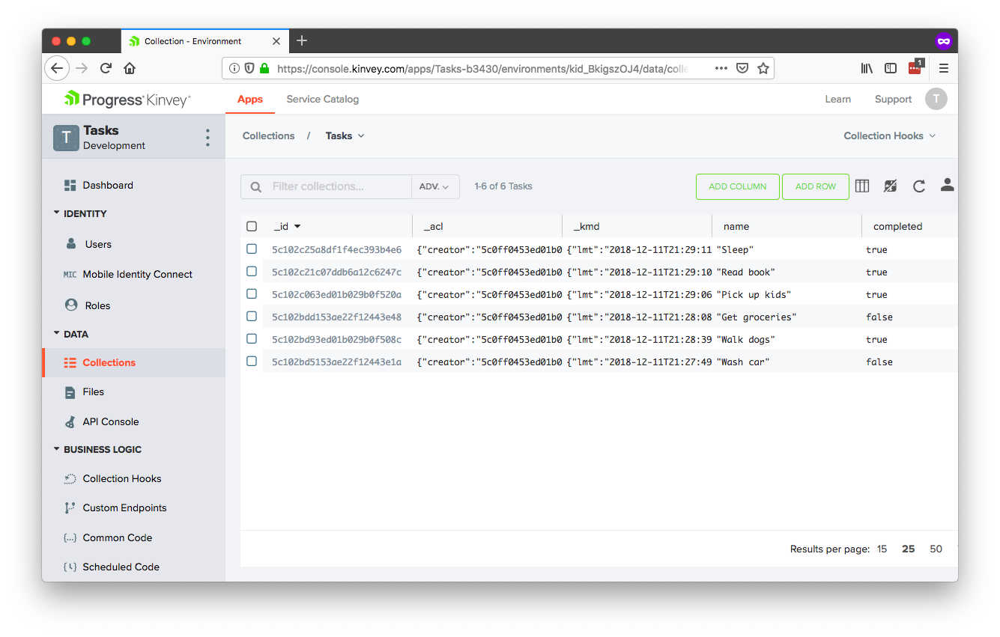

Cool, huh? Starting with a simple to-do list app like this is a great way to learn what Kinvey and NativeScript can do. With that in mind, here are a few features you could try adding to this sample as a learning exercise.

* **Deleting**—Give users a way to delete tasks. You could do this by providing buttons in each list item, or by allowing users to swipe-to-delete using the [NativeScript RadListView control](https://docs.telerik.com/devtools/nativescript-ui/Controls/Angular/ListView/swipe-actions).
* **Editing**—Allow users to do inline edits of the text of each item in the list.
* **Activity Indicators**—Use the [NativeScript ActivityIndicator](https://docs.nativescript.org/angular/ui/ng-ui-widgets/activity-indicator) component to show users when their data is loading.
* **Offline**—Make the form work even when users are offline. Kinvey makes implementing this functionality trivial; [check out the Kinvey documentation on the topic](https://devcenter.kinvey.com/nativescript/guides/datastore#CachingandOffline).

If you got lost at all during this section, here’s a [**complete version of the sample app in Playground**](https://play.nativescript.org/?template=play-ng&id=Hqp5UQ&v=2978) you can refer to.

<h2 id="step-7">Step 7: Do cool stuff</h2>

In this article we looked at how to get up and running with NativeScript and Kinvey fast. But we’re only scratching the surface of what these two technologies can do.

Now that you have the basics in place, you’re ready to dive deeper and leverage some of the powerful functionality Kinvey has to offer. Specifically, you might want to check out the following:

* [**FlexServices**](https://devcenter.kinvey.com/nativescript/guides/flex-services#)—FlexServices are low code, lightweight Node.js microservices that are used for data integrations and functional business logic. They’re a great way to add custom logic to your apps without needing to worry about infrastructure, deployment, scaling, or maintenance.
* [**Push notifications**](https://devcenter.kinvey.com/nativescript/guides/push#)—Kinvey makes it easy to configure and send push notifications in your iOS and Android applications.
* [**File storage**](https://devcenter.kinvey.com/nativescript/guides/files#)—Kinvey lets you store and retrieve files up to 5TB in size, and serves them using a Content Delivery Network (CDN) for performance.
* [**And more!**](https://devcenter.kinvey.com/nativescript/guides#)—Kinvey can do a lot, so make sure to check out the Kinvey documentation for a full list of just what’s possible.

So what are you waiting for? If you haven’t already, [sign up for a free Kinvey account](https://console.kinvey.com/signup), visit the [NativeScript Playground](https://play.nativescript.org/), and start building awesome apps.
