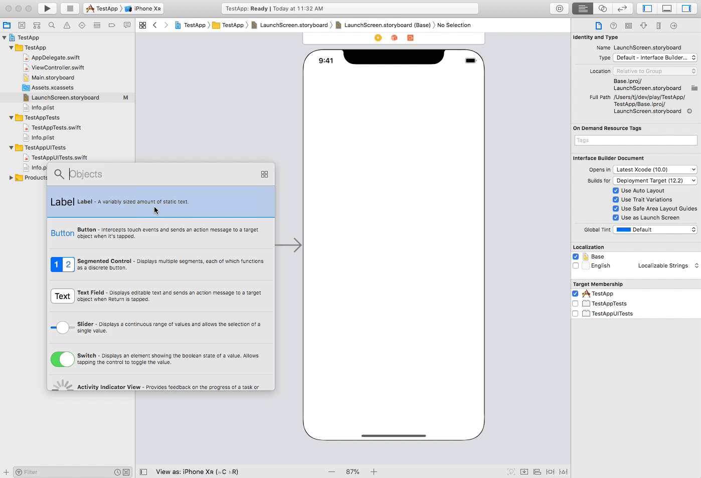

# Why Low Code Doesn’t Have to Be Awful

Before I worked at Progress, I had a nine-to-five job building apps at a rather large insurance company here in the US. I liked working there, but at some point, our executive team decided that the development team wasn’t creating apps fast enough. To address this lack of pace, they purchased a “low code” tool that, for this article’s purposes, we’ll call AppMaker2000.

AppMaker2000 had a gorgeous homepage that promised everything you can imagine and more. Build apps fast! No development skills needed! Yet, despite its allure, AppMaker2000 quickly became a derogatory slur among developers at the company. It required us to throw out skills we already had, and it built generated apps that we knew we could build better and faster by hand.

My story is not unique, as nearly every developer has used (and hated) a similar tool in their career. But it doesn’t have to be this way.

## Defining low code

Although “low code” has come to represent developer-unfriendly software, the term itself _shouldn’t_ have negative connotations. Low code just means building software with a minimal amount of code, which isn’t necessarily a bad thing. After all, one of the main goals of software development is to automate repetitive tasks, and writing code can absolutely be repetitive and error prone.

In fact, many low-code tools are already well received in the development community. For example, Xcode, the iOS development platform, recommends using visual Storyboards as the primary means of building iOS views. Storyboards let you see the canvas you’re building for, and to drag-and-drop the UI components you need directly.

Unity, the popular game development platform, also allows you to visually add components to your scene, as well as GUIs for configuring things like lighting, sound, and app assets.

Good examples of low code: Xcode, Android Studio, Visual Studio Code

## What makes a low-code tool good?

- Extensibility

- High-quality code 
    - Security

- Exit button

## Kinvey Studio

- Industry standards out of the box (security)
