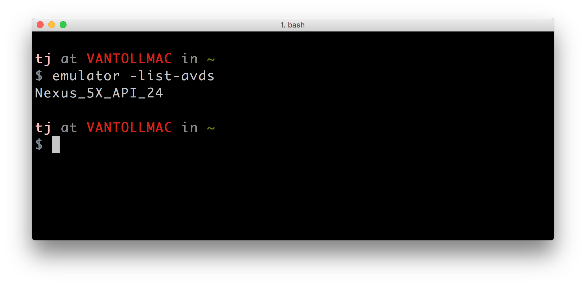
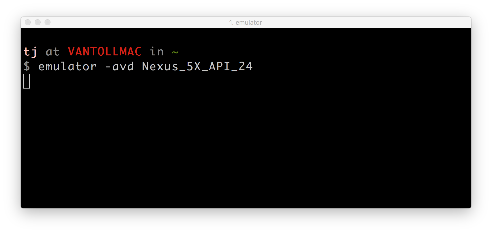
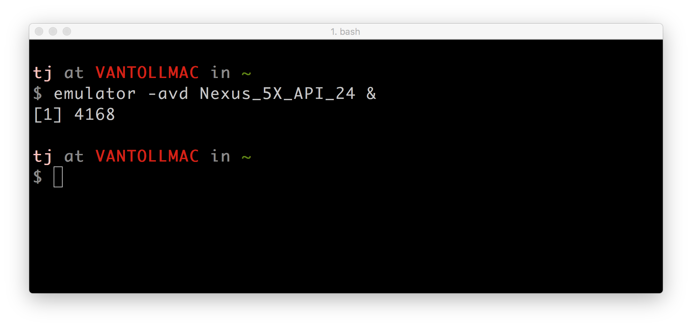
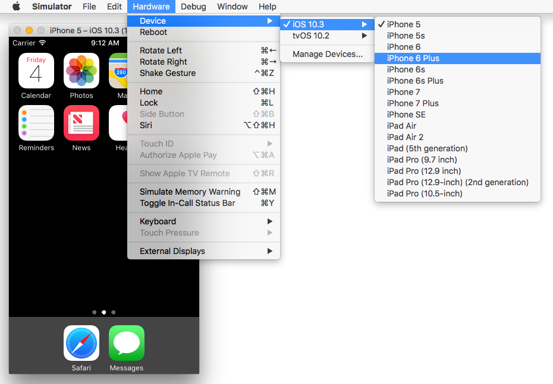
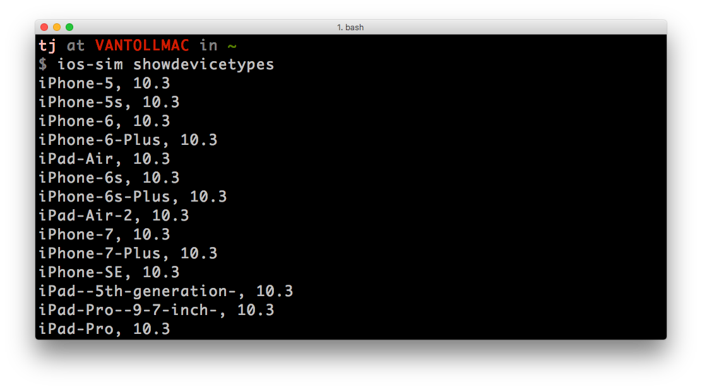
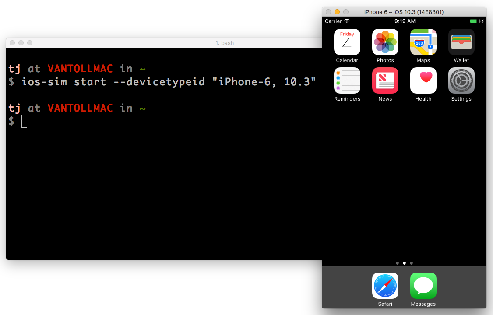

# How to Launch Android Emulators and iOS Simulators From the Command Line

I use the iOS Simulator and AVDs (Android Virtual Devices) heavily, and I was getting frustrated needing to manually launch the two from Xcode and Android Studio, respectively.

So I spent a little time setting up commands that let me launch these tools from my terminal. I named them  `ios-simulator` and `android-emulator`, and here’s what they look like in action.


In this article I’ll walk through how you can set up these commands on your own machine.

## Launching Android AVDs

When you [install the Android SDK](https://developer.android.com/studio/install.html) you get a little called `emulator`. The `emulator` command is the Google-blessed way to work with Android AVDs from the command line, and has [a number of options](https://developer.android.com/studio/run/emulator-commandline.html) that let you do a wide range of things.

The first command you’ll want to know is `emulator -list-avds`, as it lists all AVDs you currently have configured. For example, here’s what that command looks like when I run it on my Mac.



Once you have an AVD’s name, you can start up that AVD with the `emulator` command’s `-avd` option. For example here’s how I run my Nexus 5X AVD using the `emulator` command.



When you run the `emulator` command with the `-avd` flag the process that runs the AVD remains active—meaning, you are unable to type subsequent commands into your terminal. You could open a new terminal tab or window, but you could also try appending a `&` to the end of the command, which is a [little Linux trick to run a process in the background](https://kb.iu.edu/d/afnz). With the addition of an ampersand, the AVD will run in the background and you’ll regain control of your terminal.



> **NOTE**
> * The `[1] 4168` bit you see above is a process id, which you can safely ignore. If you’re really curious, you can [read up on what process ids are and how they work](https://www.digitalocean.com/community/tutorials/how-to-use-ps-kill-and-nice-to-manage-processes-in-linux).
> * Even though the `emulator` process will now run in the background, the process still will interrupt your terminal to show output from time to time. You can safely use `Ctrl+C` to regain control. If this becomes too annoying you can always switch to running the `emulator` command without the ampersand, and just give the process its own tab or window in your terminal.

At this point you’re now able to successfully launch Android AVDs from your command line. The full workflow is: 1) use `emulator -list-avds` to see a list of your current AVDs. 2) use `emulator -avd <avd-name>` to launch the AVD.

I wanted to simplify these two steps into one, because I do the vast majority of my development on a single AVD. Therefore, I created an `alias` in my `~/.bash_profile` file that lets me launch my preferred emulator using a single command.

```
alias android-avd="emulator -avd Nexus_5X_API_24 &"
```

> **NOTE**: Aliases are essentially shortcuts you can use to avoid typing long or complicated commands. If you haven’t used aliases or opened your `~/.bash_profile` before, here’s a [bit of background information](https://www.moncefbelyamani.com/create-aliases-in-bash-profile-to-assign-shortcuts-for-common-terminal-commands/) you might find useful.

And with that, you can now type `android-avd` in your terminal to open an Android AVD.


With Android out of the way, let’s move on to take a look at how iOS simulators work.

## Launching iOS Simulators

Much like Android, there are a lot of different ways you might want to launch iOS simulators from the command line. The simplest is to use your Mac’s `open` command to start the Simulator directly from the file system. That approach looks like this.

```
open /Applications/Xcode.app/Contents/Developer/Applications/Simulator.app/
```

With the simulator running you can change between various iOS device types using the Simulator app’s **Hardware** --> **Device** menu.



If you’d like to launch simulators of a specific type right from the command line, you can use the [PhoneGap team’s ios-sim tool](https://github.com/phonegap/ios-sim).

First install ios-sim from npm.

```
npm install -g ios-sim
```

Next use the `showdevicetypes` command to see a list of all simulators configured on your machine.



Finally, run the `start` command, and pass in one of the device types from the previous command in as a `--devicetypeid` parameter. For example the following command starts an iPhone 6 simulator running iOS 10.3.

```
ios-sim start --devicetypeid "iPhone-6, 10.3"
```

And here’s what that looks like in action.



And with that, you should now have a few different options for launching iOS simulators from the command line. As with Android, you may wish to save your preferred means of launching simulators off in an alias. Here’s the one I have defined.

```
alias ios-simulator="open /Applications/Xcode.app/Contents/Developer/Applications/Simulator.app/"
```

And that allow me to run the `ios-simulator` command I showed at the beginning of this article.


## Final notes

If you do give these steps a shot make sure to let me know what you think. Also, if you use an alternative workflow that you personally use, make sure to let me know as well. I’m always looking to come up with better ways to optimize these sort of common mundane tasks.