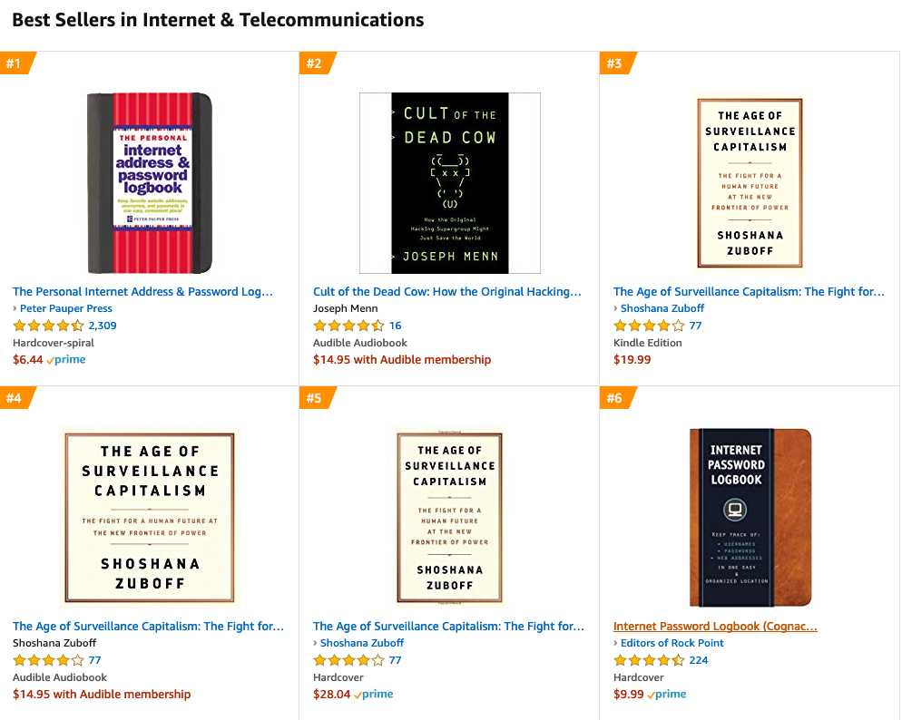
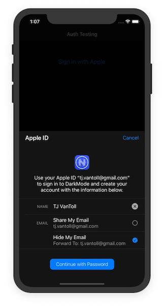

# Why ‘Sign in with Apple’ is Actually Pretty Great

I believe that Apple’s [recently announced ‘Sign in with Apple’ workflow](https://www.zdnet.com/article/wwdc-2019-apple-announces-sign-in-with-apple-feature/) is an important step for improving the security and usability of login screens.

In this article I’ll explain what ‘Sign in with Apple’ is, why I believe it’s a great thing for users, and the drama around Apple’s implementation.

The crux of my argument is that Apple’s new workflow provides badly needed innovation for a process everyone hates—logging in. Even if Apple’s implementation is flawed (which we’ll get to), hopefully this effort will spur other ideas from other tech giants in response, ideally making the login process better for everyone. To show what I’m talking about let’s start with a bit of background.

## Why passwords are the worst

A [2018 survey done by LastPass](https://blog.lastpass.com/2018/05/psychology-of-passwords-neglect-is-helping-hackers-win.html/) showed that 59% of people always or mostly use the same password—everywhere. The same study found that 45% of people don’t bother changing their password when their accounts get hacked, and that 42% of people keep passwords in a file, like, a Word doc or Excel spreadsheet.

As I write this article, the top-selling book in [Amazon’s “Internet & Telecommunications” category](https://www.amazon.com/gp/bestsellers/books/3705/ref=zg_b_bs_3705_1) is the _internet address & password logbook_. Sixth place in the same category is the _INTERNET PASSWORD LOGBOOK_, which honestly has a nicer design than the top seller.

_We have failed. Failed **hard**._

As easy as it is to mock books like this, it’s important to remember that these books are solving a real problem. Using unique passwords is important, but remembering multiple passwords in your head is impossible, and not everyone has the money and tech savviness to use a password manager.

Funnily enough, you can make a compelling argument that physical-password-book users are more secure than password reusers, assuming the physical-password-book users create unique passwords for each service they use.

Regardless, the sheer existence of these books is indicative of just how broken the login process is for most users today.

## Making login better

Everyone knows the current way we log in is not ideal, and plenty of tech companies have tried to make this process better. One big improvement to login screen usability was the advent of Single Sign-On, wherein the user uses a single account to authenticate with multiple apps or services.

_An example of Single Sign-On in an iOS app. The user can use Google or Facebook to authenticate._

The main appeal of SSO is that users don’t have to create and remember a new set of credentials, allowing them to maintain a one-password lifestyle, without the normal downsides of password reuse.

However, despite its appeal, SSO has its drawbacks as well. Specifically, most SSO providers require that you give the service you’re authenticating with your email address (and sometimes other information as well).

While providing an email address seems innocuous, shady services will often sell lists of email addresses to advertisers or spammers, greatly increasing the spam mail you have to deal with. Far worse, even if a service has no malicious intentions, data breaches can expose your email to hackers worldwide, opening up the possibility of attacks on accounts you’ve created around the Web with that same email.

## Enter Apple

With this backdrop in mind, earlier this month Apple announced a new ‘Sign in with Apple’ feature that, at first glance, works very similarly to the SSO mechanisms from Google, Facebook, and others that thousands of apps use today.

However, Apple’s new authentication workflow offers one innovative twist: when you sign in with Apple, you get to choose whether you want to share your email with the service you’re signing up for, or, whether to hide it from that service.

_An example of ‘Sign in with Apple’ in action in a sample app._

If you choose to hide you email, Apple will generate a randomly generated Apple-hosted email address, which will receive all messages on your behalf, and forward them to your legitimate email address.

This workflow alleviates many of the privacy concerns associated with similar SSO solutions from companies like Google and Facebook. If a shady service sells your email to an advertiser, you’ll be able to easily turn off email forwarding to stop the unwanted spam. Even better, if your generated email address gets exposed in a data breach, you can rest assured, as your Apple-generated email address is unique, therefore hackers will be unable to use that address in subsequent attacks.

It’s an elegant solution to a common problem, a solution that the likes of Google and Facebook might be hesitant to replicate, because each are companies that earn the bulk of their revenue from advertisers—advertisers that very much like to track users by their email address around the Web. Because Apple does not rely on a similar revenue model, they’re uniquely positioned to innovate and offer users a privacy-focused authentication option. That being said, Apple is not without its own motives.

## The drama

Apple has a vested interest in being seen as a privacy-focused company, therefore, for them, creating and promoting the ‘Sign in with Apple’ workflow makes a lot of sense.

More interesting is the news that broke shortly after WWDC, when developers found documentation that stated Apple will **require** apps that support third-party logins to provide a way to sign in with Apple. Here’s the [exact wording from Apple’s site](https://developer.apple.com/news/?id=06032019j).

> “Sign In with Apple will be available for beta testing this summer. It will be required as an option for users in apps that support third-party sign-in when it is commercially available later this year.”

This controversial decision immediately sparked a heated debate in the tech world. Those against Apple’s decision argued that Apple is using their monopolistic control over the iOS platform to advance their own SSO solution.

<blockquote class="twitter-tweet" data-lang="en">
Leveraging their position as gated community guard to push their own single sign on product?  Yeah, thats going to get looked at by the EU at the very least.  Doesn&#39;t matter if its an additional option or not, the fact that its required is enough...
&mdash; Richard Price (@RichardPrice) <a href="https://twitter.com/RichardPrice/status/1135680325244182528?ref_src=twsrc%5Etfw">June 3, 2019</a></blockquote>

<blockquote class="twitter-tweet" data-lang="en">
woah. It is &quot;walled garden&quot; moves like this that make me glad I write web apps.
&mdash; Jared Beck (@jaredowenbeck) <a href="https://twitter.com/jaredowenbeck/status/1135674803850022912?ref_src=twsrc%5Etfw">June 3, 2019</a></blockquote>

<blockquote class="twitter-tweet" data-lang="en">
Monopolist gonna monopolist
&mdash; Caitlin Fitzharris (@caitlintackles) <a href="https://twitter.com/caitlintackles/status/1136101790112395265?ref_src=twsrc%5Etfw">June 5, 2019</a></blockquote>

The timing is indeed interesting, as [Apple is actively being sued by developers and consumers for its App Store policies](https://www.progress.com/blogs/is-the-ios-app-store-a-monopoly-and-is-that-a-good-thing). You might think the company would want to avoid potentially monopolistic moves while other parts of their platform have active anti-trust lawsuits against them, but apparently Apple isn’t worried, or doesn’t think their actions here are monopolistic.

On the other side of the argument, those in favor of Apple’s decision to require ‘Sign in with Apple’ argue that Apple _has_ to require their new workflow for apps to actually use the feature.

<blockquote class="twitter-tweet" data-lang="en">
The problem &quot;Sign In With Apple&quot; is that it&#39;s so delightfully privacy-safe that developers won&#39;t offer it. They crave your real email address for reengagement campaigns. Fb happily provides it.
&mdash; Josh Constine (@JoshConstine) <a href="https://twitter.com/JoshConstine/status/1135648571196239872?ref_src=twsrc%5Etfw">June 3, 2019</a></blockquote>

<blockquote class="twitter-tweet" data-lang="en">
Seems like it&#39;d have to be. Otherwise it&#39;d share the same fate as all that BrowserID, OpenID kinda stuff. I think apps often support SSO because they want the data that comes with it. Most were never interested in supporting an option that didn&#39;t come with the data.
&mdash; Moxie Marlinspike (@moxie) <a href="https://twitter.com/moxie/status/1135769100305592326?ref_src=twsrc%5Etfw">June 4, 2019</a></blockquote>

<blockquote class="twitter-tweet" data-lang="en">
I love this. As someone who doesn’t have a facebook or google account and doesn’t want to create accounts to use apps, I’m glad they’re forcing this. It seems like it’s not ideal for apps (in terms of not being able to collect data) and if it wasn’t mandatory I doubt they’d do it
&mdash; Lloyd Braun (@jonkit) <a href="https://twitter.com/jonkit/status/1135725021475803136?ref_src=twsrc%5Etfw">June 4, 2019</a></blockquote>

This side of the argument is compelling. For better or worse, there’s very little incentive for individual apps to implement privacy-focused features for users, so it stands to reason that most would just ignore Apple’s new API if they could.

Remember BrowserID? It was a [feature championed by Mozilla to provide SSO across the web using your email address](https://hacks.mozilla.org/2011/07/introducing-browserid-easier-and-safer-authentication-on-the-web/). It was a great idea, and had some real benefits for users, but it never took off because [very few developers actually integrated it](https://techcrunch.com/2014/03/08/mozilla-stops-developing-its-persona-sign-in-system-because-of-low-adoption/).

If you’re an app maker, why would you implement BrowserID or ‘Sign in with Apple’ when you have a roadmap full of backlogged tasks? Moreover, the Apple-based workflow potentially prevents your service from gathering user data, which is something all marketing and sales departments will have a hard time accepting unless forced.

So although ‘Sign in with Apple’ isn’t perfect, and although it’s concerning to give Apple even more control over iOS users, at least the mandate will force all apps that use third-party logins to seriously reassess how they handle their user’s data.

## The broader point

More broadly speaking, my hope is that Apple’s push here will lead to further advancements into the password management world. It’s 2019 and most people are buying password managers, buying books to write down their passwords, or just giving up and logging in with their cat’s name across the Web. I think we have every right to demand more of the tech giants to help fix this.

For example, both Google and Facebook claim to care about their users’ privacy, and both have the resources to create similar systems, so why shouldn’t we demand they provide a way to authenticate into third-party apps with similar privacy protections?

It’ll be interesting to see how things play out, but I’m excited to see Apple taking an assertive step forward. 

---

Here at Progress we already have you covered to work with Apple’s new APIs. [NativeScript](https://www.nativescript.org/) users can start experimenting with ‘Sign in with Apple’ today with the new [nativescript-apple-sign-in plugin](https://github.com/EddyVerbruggen/nativescript-apple-sign-in).

And because ‘Sign in with Apple’ is based on OAuth 2.0, [Kinvey](https://www.progress.com/kinvey) users will be able to work with Apple’s new workflow with [Kinvey’s Mobile Identity Connect](https://devcenter.kinvey.com/nativescript/guides/mobile-identity-connect) later this fall.

