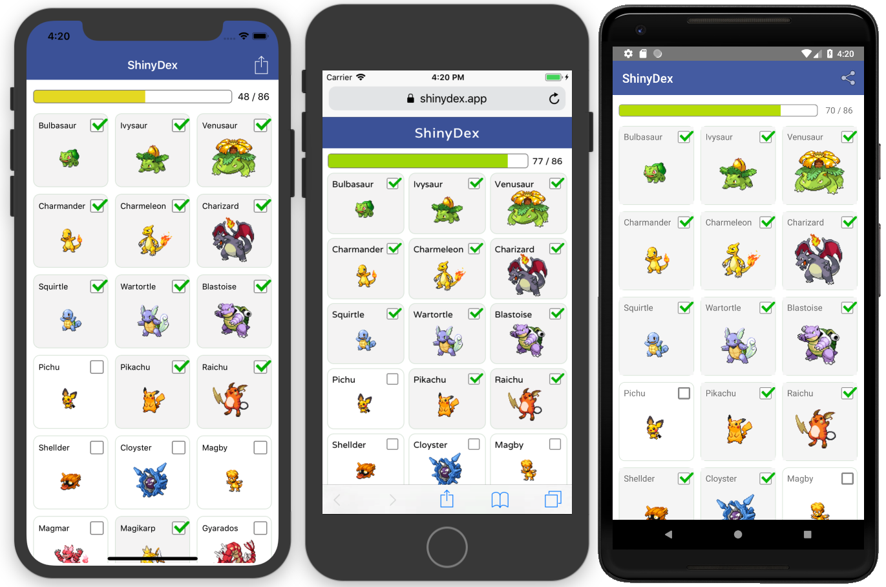

# How to Build a PWA, an iOS App, and an Android App—From One Codebase

I have a long history of choosing between web and native, often wrongly. I’ve built web apps that were scraped for outsourced native apps, and I’ve wasted time building native apps that found no audience.

And in my current job as a mobile-focused developer advocate at [Progress](https://www.progress.com/), I talk to developers that regret their web or native decision every week. Sometimes you don’t realize you need a native app until you hit the limitations of the web, and conversely, sometimes you realize a web app meets your needs only after you’ve went through the lengthy process of building multiple native apps.

The good news is JavaScript developers no longer have to make this difficult choice. Through the use of the recently announced [NativeScript and Angular integration](https://blog.angular.io/apps-that-work-natively-on-the-web-and-mobile-9b26852495e7), it’s now quite easy to build a PWA, a native iOS app, and a native Android app from one codebase.

In this article I’ll show you how it works. You’ll learn the steps you’ll need to take, as well as some tips and tricks I learned from building an Angular app for all three platforms.

## Starting your app

Over the last month I built an app called ShinyDex and deployed it the App Store, Google Play, and the web. The app is a purposely simple checklist app designed to help teach how the NativeScript and Angular technology stack work.

