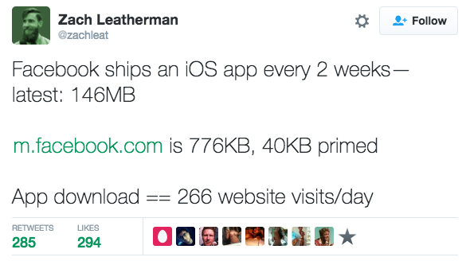
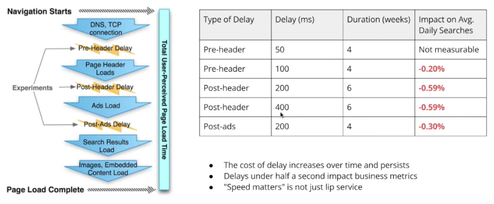
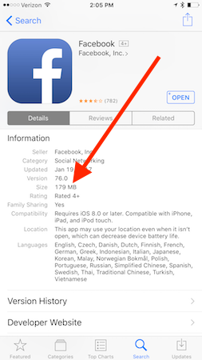
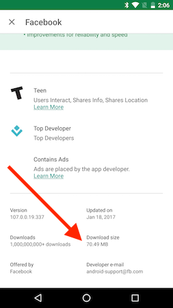

# Why Building a Big Native App Can Be OK

Native mobile apps binaries can be big, and for developers—especially web developers—it’s easy to poke fun at just how large these applications are.

<!-- https://twitter.com/zachleat/status/766389127751143424 -->

And for good reason. Web developers have been trained to watch every byte they put in their applications like a hawk, as numerous studies have shown that [slower web apps cost companies real money](http://blog.gigaspaces.com/amazon-found-every-100ms-of-latency-cost-them-1-in-sales/). On the web a 2 meg app is big, a 5 meg app won’t load on some of your user’s devices, and a 10 meg app will [summon Paul Irish](https://github.com/reddit/reddit-mobile/issues/247). But something I’ve learned while working on [NativeScript](https://www.nativescript.org) is that native apps are different, and the same size rules don’t apply.

Today I’d like to argue something potentially controversial: I believe that not only is building a big native app ok, but that native is a better platform for apps that need a ton of code or assets. You’re welcome to disagree, but before you write a Medium thoughtpiece on the purity of the web and the importance of building small apps for people in rural countries with limited connectivity, hear me out for a minute.

## Size == slow?

As I mentioned before, there have been [tons of studies](https://mobiforge.com/research-analysis/how-important-is-web-performance) that tie slow web apps to lost users and revenue. Google, for instance, ran an interesting study where they delibrately slowed down searches for certain users. And—no surprise—they found that users with slower experiences performed fewer searches.

*Results of Google artificially introducing delays, and the affect of those delays on their users. The chart comes from [Ilya Grigorik’s excellent talk on the topic](https://www.youtube.com/watch?v=Il4swGfTOSM).*

There are a number of things that can cause a slow user experience, but one of the major ones is the sheer file size of the app. [Google’s own web performance guidelines](https://developers.google.com/web/fundamentals/performance/) list “Optimizing Content Efficiency” as their first tip; here’s what that tip says verbatim.

> “To deliver great performance you need to optimize delivery of each and every byte of your site.”

On the web size matters because those bytes have to be transferred across the network on the fly, which can [take a long time](https://www.igvita.com/2012/07/19/latency-the-new-web-performance-bottleneck/), even on modern mobile networks. Mobile browsers have caches, but they’re [notoriously small](http://www.webperformancetoday.com/2012/07/12/early-findings-mobile-browser-cache-persistence-and-behaviour/) and challenging to configure correctly. The web’s new [service worker specification](https://developers.google.com/web/fundamentals/getting-started/primers/service-workers) aims to add more power to web caching, but service workers are also [a bit complex](http://developer.telerik.com/featured/what-progressive-web-apps-mean-for-the-web/), and they’re [likely not going to be available on iOS in the forseeable future](https://webkit.org/status/#specification-service-workers).

Regardless of where you stand on the complexity of caching resources on the web, one thing is clear—native has it a whole lot easier. In a native app you have the abiliity to package your code, images, and so forth directly within the package your distribute through app stores. 

And that packaging can make an enormous difference on the speed of applications. On the web rendering an interface is a two-step process: first the browser must download assets, sometimes from a network, sometimes from a cache on disk, and then the browser must paint a UI. Although modern browsers are incredibly smart about concurrently handling these two steps when possible—that is, painting the UI while still downloading assets—they can’t compete with native apps that usually already have everything they need.

There is one major caveat to this: native apps still need to get those assets at some point, and downloading a large app from an app store can take some time. Which begs the question of whether users care.

## Do users mind big apps?

Some do, yes. Not everyone has a fast internet connection, and no one unlimited space on their device. You don’t have to look far to find users complaining about the size of native apps, especially 100+ meg ones like Facebook.

But a whole lot of people don’t care.

One reason for this indifference is both the iOS App Store and Google Play hide application sizes in not-especially-obvious places. On iOS you have to scroll down to an “Information” section and sift through a bunch of metadata to locate an app’s size.

On Android the app size is even harder to find, as you must tap a “READ MORE” link, scroll, and find a “Download size”.

The initial download of an app is only part of the story, as most native apps publish regular updates—updates that in most cases require the entire application to be re-downloaded. But even those updates aren’t likely to be noticed by a user, as both iOS and Android now auto update applications in the background by default. Although neither Apple nor Google publish statistics on just how many users auto update, it’s safe to say that it’s a decent majority, as [most users don’t change their default settings](https://www.uie.com/brainsparks/2011/09/14/do-users-change-their-settings/).

Futher proof of users’ collective indifference towards app sizes can be found on lists of most-downloaded apps. For example, here are the [10 most downloaded iOS apps in 2016](http://mashable.com/2016/12/06/most-downloaded-apps-2016).

1. Snapchat—93.2 MB
1. Messenger—169 MB
1. Pokémon GO—216 MB
1. Instagram—47.7 MB
1. Facebook—176 MB
1. YouTube—74.1 MB
1. Google Maps—73.4 MB
1. Pandora—64.6 MB
1. Netflix—46.1 MB
1. Spotify Music—81.4 MB

Note how the average file size of a top-10 iOS app is over 100 megs, and the smallest is a still-large-feeling 46 megs. If users do have issues with large apps, their behavior doesn’t show it.

> For Android, a list of top apps is more difficult to draw conclusions from, as so many of the top downloaded apps are built into Android. But the [most popular third-party Android apps](https://en.wikipedia.org/wiki/List_of_most_downloaded_Android_applications) are WhatsApp Messenger, Facebook Messenger, and Facebook—which are currently 18 MB, 48.6 MB, and 72.7 MB, respectively.

Now, to back up for just a moment, I don’t present this data to imply that native apps can be limitless in size, as there are certainly reprecussions from making native apps _too_ big. What I do mean to show is that the lower bound for an acceptable application size is fundamentally different on native than it is on the web. While it’s easy to find people complaining about the 150+ meg Facebook iOS app, you’ll have trouble finding anyone complaining about a 46 meg Netflix app, or even a 73 meg Google Maps app. These are sizes that the average mobile user has deemed acceptable.

The lower bounds for size will vary based on average user connection speed and average device storage worldwide. So while users in the US might be ok with 40+ meg apps, users in India may not. But those same constraints will negatively affect web browing as well. That is, a 10+ meg app might have trouble gaining mass adoption in India, but a 1+ meg web app will have trouble gaining usage as well.

## So what should you do for your own app?

All apps are different, so it’s difficult to make sweeping web versus native recommendatations, or to give a dictate on when an app is _too big_, regardless of platform.

But I will say this: I think native apps get a bad rap for being unnecessarily big or bloated. Engineers at companies like Facebook, Google, and Snapchat aren’t stupid; they realize that increasing app size can have a negative impact on user acquisition and retention.

But they also realize that a bigger native app can help build a better user experience. By packaging assets with the application, these apps don’t have to download these same files during runtime, decreasing load times in an era of [notoriously impatient users](http://webdesignfromscratch.com/basics/people-are-impatient/).

After all, Snapchat’s iOS app is nearly 100 megs, but they have [over 300 million monthly active users](http://www.fool.com/investing/2016/11/23/snap-in-3-charts.aspx). Pokémon GO’s iOS app is over 200 megs, yet the app [made $950 million in 2016](http://venturebeat.com/2017/01/17/pokemon-go-generated-revenues-of-950-million-in-2016/). I could keep going too—Facebook, YouTube, Instagram, and Pandora all have large apps, and they aren’t exactly a list of unsuccessful brands.

This is also a list of large brands with big name recognition and large engineering resources, so again—just because Facebook can build a 100 meg mobile app and make tons of money, that doesn’t mean you can. But you can probably build a 20 meg one without anyone noticing—and maybe use those 20 megs to build a pretty awesome user experience.

